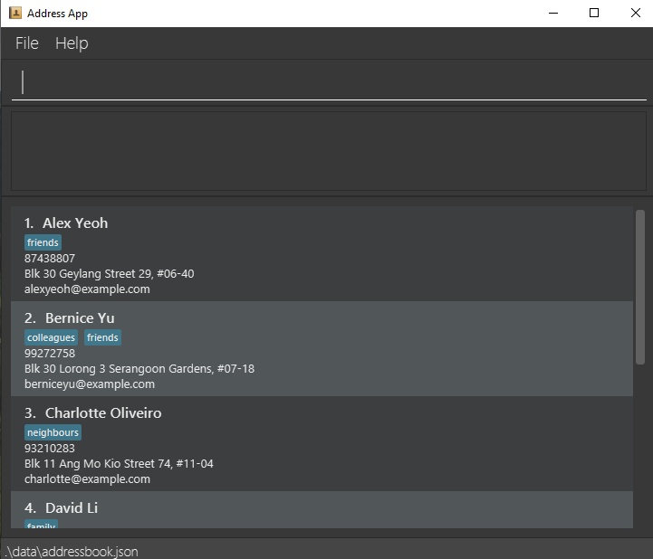

# Project Description

>This project is based on the AddressBook-Level3 project created by the [SE-EDU initiative](https://se-education.org).

## What is AddressBook π (Abπ)?
***

**Abπ** is an improvement of **[AB3](https://se-education.org/addressbook-level3)** and it is optimized specifically for
users who prefer typing via the Command Line Interface(CLI) while still having the benefits of a Graphical User Interface (GUI).
It helps users keep track of their professional contacts, separating it from their personal contacts.
 

**Basic Features in AB3:**
- [x] Add contacts.
- [x] Delete contacts.
- [x] Edit contacts.
- [x] Locating contacts by name.
- [x] Listing all contacts.
- [x] Clear all contacts.
- [x] Exit the program.
- [x] Saving the application data into a file.
- [x] Editing the data file.

**Upcoming Features in ABπ that is not in AB3:**
- [ ] Find contacts by their name, phone number, tags and email.
- [ ] Copy all emails into the clipboard.
- [ ] Prevent duplicated phone number and email.
- [ ] Memo feature.
- [ ] Shortcuts to invoke most recently used command.

## Instructions
***
~~**All you need to do is:**~~

Currently, there are no instructions to download ABπ because it is still in the development phase.
***

