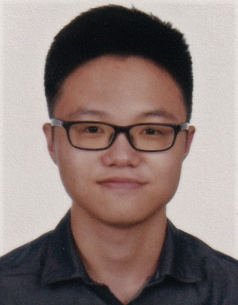
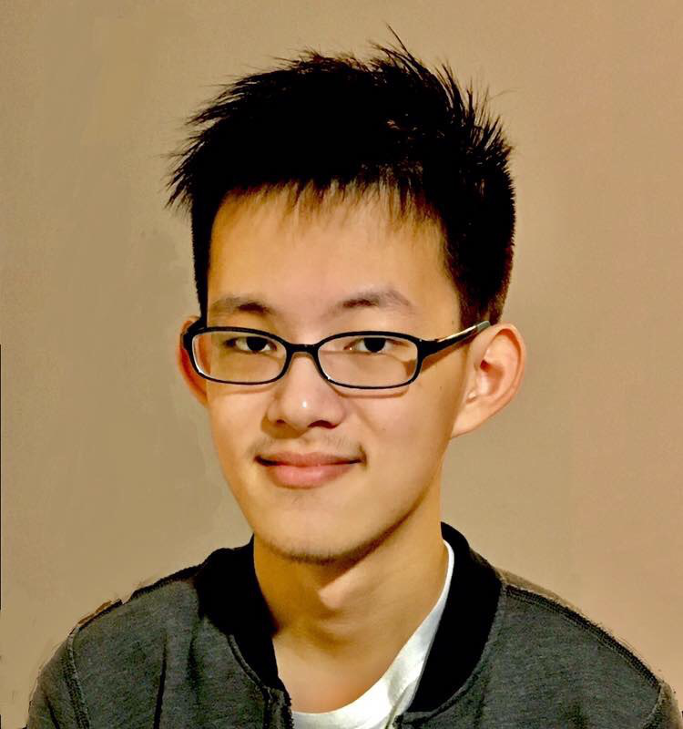
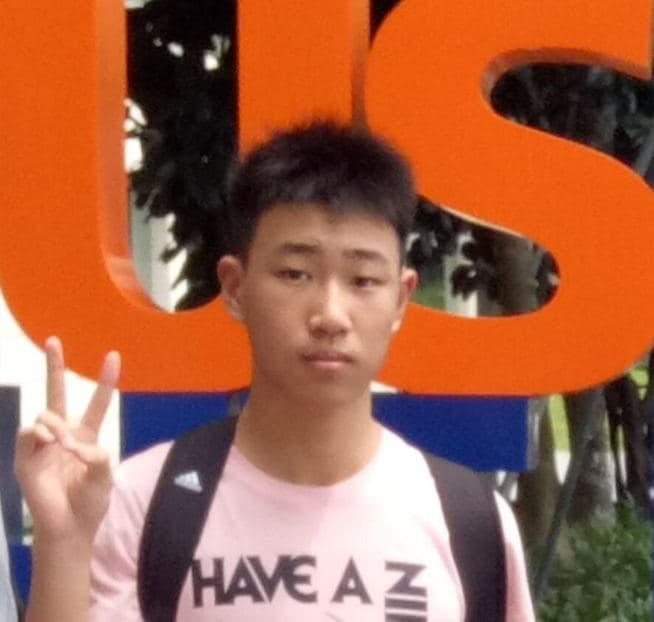

We are a team based in the [School of Computing, National University of Singapore](http://www.comp.nus.edu.sg).

You can reach us at the email `e0544426@u.nus.edu` or `e0544387@u.nus.edu`.

## Project team

### Alvin Tay Ming Hwee

[github](https://github.com/atmh) | [portfolio](team/atmh.md)

* Role: Scheduling and tracking.
* Responsibilities: In charge of defining, assigning, and tracking project tasks.

### Huang Xing Chen

[github](http://github.com/lovemathboy) | [portfolio](team/lovemathboy.md)

* Role: Code Quality.
* Responsibilities: Looks after code quality, ensures adherence to coding standards.

### Tan De Shao

[github](http://github.com/tandeshao) | [portfolio](team/tandeshao.md)

* Role: Deliverables and deadlines.
* Responsibilities: Ensure project deliverables are done on time and in the right format.

### Xu Peizhe

[github](http://github.com/xpzmichael) | [portfolio](team/xpzmichael.md)

* Role: Documentation.
* Responsibilities: Responsible for the quality of various project documents.
