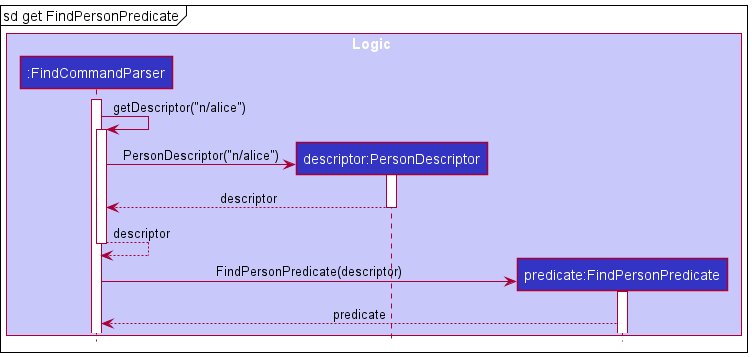
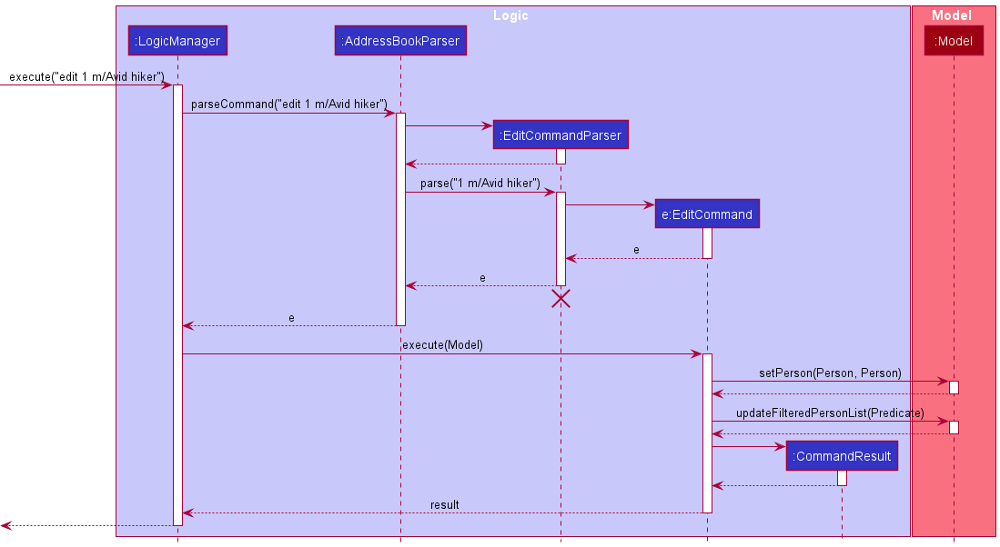

## Table of Content  
[1. Acknowledgements](#1-acknowledgements)  
[2. Setting up, getting started](#2-setting-up-getting-started)  
[3. Design](#3-design)  
&nbsp;&nbsp;[3.1. Architecture](#31-architecture)  
&nbsp;&nbsp;[3.2. UI component](#32-ui-component)  
&nbsp;&nbsp;[3.3. Logic component](#33-logic-component)  
&nbsp;&nbsp;[3.4. Model component](#34-model-component)  
&nbsp;&nbsp;[3.5. Storage component](#35-storage-component)  
&nbsp;&nbsp;[3.6. Common classes](#36-common-classes)  
[4. Implementation](#4-implementation)  
&nbsp;&nbsp;[4.1. Undo and redo feature](#41-undo-and-redo-feature)  
&nbsp;&nbsp;&nbsp;&nbsp;[4.1.1. Design considerations](#411-design-considerations)  
&nbsp;&nbsp;[4.2. Find feature](#42-find-feature)  
&nbsp;&nbsp;&nbsp;&nbsp;[4.2.1. Design considerations](#421-design-considerations)  
&nbsp;&nbsp;[4.3. Memo and ContactedDate person attributes](#43-memo-and-contacteddate-person-attributes)  
&nbsp;&nbsp;&nbsp;&nbsp;[4.3.1. Design considerations](#431-design-considerations)  
&nbsp;&nbsp;[4.4. Duplicate detection](#44-duplicate-detection)  
&nbsp;&nbsp;&nbsp;&nbsp;[4.4.1. Design considerations](#441-design-considerations)  
[5. Documentation, logging, testing, configuration, dev-ops](#5-documentation-logging-testing-configuration-dev-ops)  
[6. Appendix: Requirements](#6-appendix-requirements)  
&nbsp;&nbsp;[6.1. Product scope](#61-product-scope)  
&nbsp;&nbsp;[6.2. User stories](#62-user-stories)  
&nbsp;&nbsp;[6.3. Use cases](#63-use-cases)  
&nbsp;&nbsp;[6.4. Non-Functional Requirements](#64-non-functional-requirements)  
&nbsp;&nbsp;[6.5. Glossary](#65-glossary)  
[7. Appendix: Instructions for manual testing](#7-appendix-instructions-for-manual-testing)  
&nbsp;&nbsp;[7.1. Launch and shutdown](#71-launch-and-shutdown)  
&nbsp;&nbsp;[7.2. Adding a person](#72-adding-a-person)  
&nbsp;&nbsp;[7.3. Editing a person](#73-editing-a-person)  
&nbsp;&nbsp;[7.4. Adding tags to a person](#74-adding-tags-to-a-person)  
&nbsp;&nbsp;[7.5. Deleting tags of a person](#75-deleting-tags-of-a-person)  
&nbsp;&nbsp;[7.6. Deleting a person](#76-deleting-a-person)  
&nbsp;&nbsp;[7.7. Finding persons by their attributes](#77-finding-persons-by-their-attributes)  
&nbsp;&nbsp;[7.8. Saving data](#78-saving-data)  

--------------------------------------------------------------------------------------------------------------------

## 1. Acknowledgements

* https://se-education.org/addressbook-level3/DeveloperGuide.html#proposed-undoredo-feature

--------------------------------------------------------------------------------------------------------------------

## 2. Setting up, getting started

Refer to the guide [_Setting up and getting started_](SettingUp.md).

--------------------------------------------------------------------------------------------------------------------

## 3. Design

:bulb: **Tip:** The `.puml` files used to create diagrams in this document can be found in the [diagrams](https://github.com/se-edu/addressbook-level3/tree/master/docs/diagrams/) folder. Refer to the [_PlantUML Tutorial_ at se-edu/guides](https://se-education.org/guides/tutorials/plantUml.html) to learn how to create and edit diagrams.

### 3.1. Architecture

The ***Architecture Diagram*** given above explains the high-level design of the App.

Given below is a quick overview of main components and how they interact with each other.

**Main components of the architecture**

**`Main`** has two classes called [`Main`](https://github.com/se-edu/addressbook-level3/tree/master/src/main/java/seedu/address/Main.java) and [`MainApp`](https://github.com/se-edu/addressbook-level3/tree/master/src/main/java/seedu/address/MainApp.java). It is responsible for,
* At app launch: Initializes the components in the correct sequence, and connects them up with each other.
* At shut down: Shuts down the components and invokes cleanup methods where necessary.

[**`Commons`**](#common-classes) represents a collection of classes used by multiple other components.

The rest of the App consists of four components.

* [**`UI`**](#ui-component): The UI of the App.
* [**`Logic`**](#logic-component): The command executor.
* [**`Model`**](#model-component): Holds the data of the App in memory.
* [**`Storage`**](#storage-component): Reads data from, and writes data to, the hard disk.

**How the architecture components interact with each other**

The *Sequence Diagram* below shows how the components interact with each other for the scenario where the user issues the command `delete 1`.

Each of the four main components (also shown in the diagram above),

* defines its *API* in an `interface` with the same name as the Component.
* implements its functionality using a concrete `{Component Name}Manager` class (which follows the corresponding API `interface` mentioned in the previous point.

For example, the `Logic` component defines its API in the `Logic.java` interface and implements its functionality using the `LogicManager.java` class which follows the `Logic` interface. Other components interact with a given component through its interface rather than the concrete class (reason: to prevent outside component's being coupled to the implementation of a component), as illustrated in the (partial) class diagram below.

The sections below give more details of each component.

### 3.2. UI component

The **API** of this component is specified in [`Ui.java`](https://github.com/se-edu/addressbook-level3/tree/master/src/main/java/seedu/address/ui/Ui.java)

The UI consists of a `MainWindow` that is made up of parts e.g.`CommandBox`, `ResultDisplay`, `PersonListPanel`, `StatusBarFooter` etc. All these, including the `MainWindow`, inherit from the abstract `UiPart` class which captures the commonalities between classes that represent parts of the visible GUI.

The `UI` component uses the JavaFx UI framework. The layout of these UI parts are defined in matching `.fxml` files that are in the `src/main/resources/view` folder. For example, the layout of the [`MainWindow`](https://github.com/se-edu/addressbook-level3/tree/master/src/main/java/seedu/address/ui/MainWindow.java) is specified in [`MainWindow.fxml`](https://github.com/se-edu/addressbook-level3/tree/master/src/main/resources/view/MainWindow.fxml)

The `UI` component,

* executes user commands using the `Logic` component.
* listens for changes to `Model` data so that the UI can be updated with the modified data.
* keeps a reference to the `Logic` component, because the `UI` relies on the `Logic` to execute commands.
* depends on some classes in the `Model` component, as it displays `Person` object residing in the `Model`.

### 3.3. Logic component

**API** : [`Logic.java`](https://github.com/se-edu/addressbook-level3/tree/master/src/main/java/seedu/address/logic/Logic.java)

Here's a (partial) class diagram of the `Logic` component:

How the `Logic` component works:
1. When `Logic` is called upon to execute a command, it uses the `AddressBookParser` class to parse the user command.
1. This results in a `Command` object (more precisely, an object of one of its subclasses e.g., `AddCommand`) which is executed by the `LogicManager`.
1. The command can communicate with the `Model` when it is executed (e.g. to add a person).
1. The result of the command execution is encapsulated as a `CommandResult` object which is returned back from `Logic`.

The Sequence Diagram below illustrates the interactions within the `Logic` component for the `execute("delete 1")` API call.

:information_source: **Note:** The lifeline for `DeleteCommandParser` should end at the destroy marker (X) but due to a limitation of PlantUML, the lifeline reaches the end of diagram.

Here are the other classes in `Logic` (omitted from the class diagram above) that are used for parsing a user command:

How the parsing works:
* When called upon to parse a user command, the `AddressBookParser` class creates an `XYZCommandParser` (`XYZ` is a placeholder for the specific command name e.g., `AddCommandParser`) which uses the other classes shown above to parse the user command and create a `XYZCommand` object (e.g., `AddCommand`) which the `AddressBookParser` returns back as a `Command` object.
* All `XYZCommandParser` classes (e.g., `AddCommandParser`, `DeleteCommandParser`, ...) inherit from the `Parser` interface so that they can be treated similarly where possible e.g, during testing.

### 3.4. Model component
**API** : [`Model.java`](https://github.com/AY2122S2-CS2103T-T17-4/tp/tree/master/src/main/java/seedu/address/model/Model.java)

The `Model` component,

* stores the address book data i.e., all `Person` objects (which are contained in a `UniquePersonList` object).
* stores the currently 'selected' `Person` objects (e.g., results of a search query) as a separate _filtered_ list which is exposed to outsiders as an unmodifiable `ObservableList<Person>` that can be 'observed' e.g. the UI can be bound to this list so that the UI automatically updates when the data in the list change.
* stores a `UserPref` object that represents the user’s preferences. This is exposed to the outside as a `ReadOnlyUserPref` objects.
* does not depend on any of the other three components (as the `Model` represents data entities of the domain, they should make sense on their own without depending on other components)

:information_source: **Note:** An alternative (arguably, a more OOP) model is given below. It has a `Tag` list in the `AddressBook`, which `Person` references. This allows `AddressBook` to only require one `Tag` object per unique tag, instead of each `Person` needing their own `Tag` objects. 

### 3.5. Storage component

**API** : [`Storage.java`](https://github.com/se-edu/addressbook-level3/tree/master/src/main/java/seedu/address/storage/Storage.java)

The `Storage` component,
* can save both address book data and user preference data in json format, and read them back into corresponding objects.
* inherits from both `AddressBookStorage` and `UserPrefStorage`, which means it can be treated as either one (if only the functionality of only one is needed).
* depends on some classes in the `Model` component (because the `Storage` component's job is to save/retrieve objects that belong to the `Model`)

### 3.6. Common classes

Classes used by multiple components are in the `seedu.address.commons` package.

--------------------------------------------------------------------------------------------------------------------

## 4. Implementation

This section describes some noteworthy details on how certain features are implemented.

### 4.1. Undo and redo feature

The address book undo and redo mechanism is managed by `StateAddressBook`, which extends `AddressBook`. It keeps track of the address book state history, stored internally as a `stateHistory` and `currentStateIndex`. `currentStateIndex` points to the current state of the address book. The number of undoable and redoable actions is capped by `UNDO_REDO_CAPACITY`, currently set to 10. Additionally, it implements the following operations:

* `StateAddressBook#undo()` — Restores the address book to its previous state.
* `StateAddressBook#redo()` — Restores the address book to a previously undid state.
* `StateAddressBook#saveState()` — Saves the current address book state in stateHistory.
* `StateAddressBook#isUndoable()` — Returns if the address book is undoable.
* `StateAddressBook#isRedoable()` — Returns if the address book is redoable.

These operations are exposed in the `Model` interface respectively as
* `Model#undoAddressBook()`
* `Model#redoAddressBook()`
* `Model#saveAddressBookState()`
* `Model#canUndoAddressBook()`
* `Model#canRedoAddressBook()`

Commands that do not modify the address book states will not call `Model#saveAddressBookState()`. The address book undo and redo mechanism only tracks commands that modify the address book state, the commands that are undoable and redoable are `add`, `edit`, `delete`, `clear`, `scrub`, `addtag` and `deletetag`.

Given below is an example usage scenario and how undo and redo mechanism behaves at each step. For demonstration, `UNDO_REDO_CAPACITY` is set to 3.

Step 1. The user launches the application for the first time. The `StateAddressBook` will be initialized with the initial address book state, and the `currentStateIndex` points to the initial address book state.

Step 2. The user executes `edit 1 n/Bob` command to edit the first person in the address book. After the `edit` command executes, it calls `Model#saveAddressBookState()`, which saves the modified state of the address book to `stateHistory`, and the `currentStateIndex` is shifted to the newly inserted address book state.

Step 3. The user executes `delete 2` to delete the second person. The `delete` command also calls `Model#saveAddressBookState()`, creating another modified address book state to be saved into the `stateHistory`. As before, `currentStateIndex` is incremented.

:information_source: **Note:** If a `Command#execute` fails, it will not call `Model#commitAddressBook()`, so the address book state will not be saved into `stateHistory` and `currentStateIndex` will not change.

Step 4. The user executes `clear` to clear the address book. The `clear` command also calls `Model#saveAddressBookState()`, creating another modified address book state to be saved into the `stateHistory`. Similarly, `currentStateIndex` is incremented.

:information_source: **Note:** If `stateHistory#isFull()` is true, i.e. size of `stateHistory` is equal to `UNDO_REDO_CAPACITY` + 1, then the state at index 0 of `stateHistory` will be removed.

Step 5. The user decides that clearing his address book was not a good idea. He executes `undo` to restore his contacts. The `undo` command calls `Model#undoAddressBook()`, which will decrement the `currentStateIndex`, shifting it left once. `currentStateIndex` now points to the previous address book state, and restores the address book to that state.

Step 6. The user wants to revert his `delete 2` command from Step 3 as well. He executes `undo` to revert the deletion. Similarly to Step 5, the `delete` command calls `Model#undoAddressBook()`, which will decrement the `currentStateIndex`, shifting it left once. `currentStateIndex` now points to the previous address book state, and restores the address book to that state.

:information_source: **Note:** If the `currentStateIndex` is at index 0, there are no previous address book states to restore. The `undo` command calls `Model#canUndoAddressBook()` to check if it is undoable. In this case, if `undo` is executed once more, return an error will be returned to the user rather than performing the undo mechanism.

The following sequence diagram shows how the undo operation works:

:information_source: **Note:** The lifeline for `UndoCommand` should end at the destroy marker (X) but due to a limitation of PlantUML, the lifeline reaches the end of diagram.

Step 7. The user can't make up his mind and decides to redo his undo. He executes `redo` to revert the previously undid command `delete 2`. The `delete` command calls `Model#redoAddressBook()`, which will increment the `currentStateIndex`, shifting it right once. `currentStateIndex` now points to the previous undid address book state, and restores the address book to that state.

  
:information_source: **Note:** If `currentStateIndex` is at index `stateHistory.size() - 1`, pointing to the latest address book state, there are no undone AddressBook states to restore. The `redo` command calls `Model#canRedoAddressBook()` to check if this is the case. If so, it will return an error to the user rather than performing the redo mechanism.

Step 8. The user executes the `list` command. Commands that do not modify the address book state, such as `list`, will not call `Model#saveAddressBookState()`. Hence, `stateHistory` does not change.

Step 9. The user executes `add n/Tom …​`, which calls `Model#saveAddressBookState()`. Since `currentStateIndex` is not pointing at the end of the `stateHistory`, all address book states after the `currentStateIndex` will be cleared by calling `StateAddressBook#clearAfterCurrentStateIndex()`. Why this is so is because it no longer makes sense to redo the `clear` command. This behaviour follows modern application undo and redo functionality.

The following activity diagram summarizes what happens when a user executes a new command:

#### 4.1.1. Design considerations:

**Aspect: How undo & redo executes:**

* **Current implementation:** Saves the entire address book.
    * Pros: Easy to implement.
    * Cons: May have performance issues in terms of memory usage.
    * Workaround: Limit the number of undoable and redoable actions, using `UNDO_REDO_CAPACITY`. Currently, it is set to 10.

* **Alternative:** Individual command knows how to undo and redo by itself.
    * Pros: `stateHistory` will use less memory. E.g. for `delete` it only needs to save the person being deleted.
    * Cons: It will take a considerable amount of effort to implement and maintain. Commands that are developed in the future, if applicable, must also support this, which adds to the complexity. It must be done meticulously to ensure that the implementation of each individual command is correct.
    
**Aspect: stateHistory data structure:**

* **Current implementation:** `stateHistory` is an `ArrayList`.
    * Pros: Easy to implement and less prone to bugs.
    * Cons: Inefficiency of removing old states. Since `stateHistory` is an `ArrayList`, when `StateAddressBook#saveState()` is called and `StateAddressBook#isFull()` is true, i.e. `stateHistory.size()` is equal to `UNDO_REDO_CAPACITY` + 1, the first index is removed via `ArrayList.remove(0)`, which has a time complexity of O(n).

* **Alternative 1:** Use a doubly linked list with next and previous pointers. 
    * Pros: O(1) time complexity for all `StateAddressBook` methods.
    * Cons: Java in-built lists do not support next and previous pointers. We will need to carefully implement a doubly linked list and ensure that it is bug free.
* **Alternative 2:** Use a `Deque` to store previous states and a `Stack` to store undid states.
    * Pros: O(1) time complexity for all `StateAddressBook` methods.
    * Cons: It can be tricky to implement the interactions between undo and redo. For example `undo`, followed by `redo`, and then `undo` again. The interaction between undo and redo needs to be managed carefully.

### 4.2. Find feature
The address book find command allow users to search contacts based on their name, email, phone, address, tags, memo and contacted date. When the user keys in a find command, the user input is parsed through a `FindCommandParser` and if a valid input is given, the `FindCommand#execute(Model)` method will be invoked. Doing this will effectively filter the person list in the `Addressbook` and this filtered list will be returned to the Ui for display.

Given below is a sequence diagram to show the execution flow of the find command and a walk-through for each step of the execution:

 
 

Step 1. When a user invokes a find command from the Ui, `LogicManager` will be called, which parses the user input into `AddressbookParser#parseCommand(String)`.

Step 2. `FindCommandParser` will then be instantiated and `FindCommandParser#parse(String)` is invoked. If a valid input is provided, `FindCommandParser#createArgMap(String)`is called.

Since a user can key in multiple valid parameters to increase the scope of a search (i.e. search by name and tags), we will need a way to identify different parts of the user input and match the input to their corresponding prefix. This can be achieved with the `ArgumentMultimap` class where it will store the descriptions to search a person by.

Step 3. The `ArgumentMultimap` object is passed as an argument into the  `FindPersonPredicate` constructor and the object created is returned to `FindCommandParser`.

  
:information_source: **Note:** Two note-worthy classes that are created in `FindPersonPredicate` but not shown in the sequence diagram is the `ExactWordMatchPredicate` and `PartialWordMatchPredicate` which encapsulate the logic of conducting exact word match and partial word match on a person's attribute respectively. They are used in the `FindPersonPredicate#test(Person)` method during the filter process and to conduct exact word match/partial word match depending on the person's attribute. More information will be given in the design consideration. 

Step 4. `FindCommandParser` will then use the created `FindPersonPredicate` object to create the `FindCommand` object and this object is returned to `LogicManager`.

Step 5. `LogicManager` will then call`FindCommand#execute(Model)` method and this method will invoke 
`Model#updateFilteredPersonList(PersonContainsKeywordsPredicate)` where it will update the filter for the person list in the address book.

Step 6. After the filter has been updated, each person in the person list will be tested against the predicate to see if any of the information in the person's attribute matches any of the keywords provided by the user. The filtered list is created and returned to the Ui.

 

#### 4.2.1. Design Considerations:

**Aspect: How the find feature executes:** 
* **Current implementation:** Each invocation of the find command filters the original person list. 
    * Pros: It is easy to implement. 
    * Cons: Users might want to filter the filtered person list even further after viewing it but with the current implementation, this is not possible.  
    * Workaround: To simulate the chaining of multiple find commands, users will have to remember their search condition(s) for the first find and add on/modify the search condition(s) in subsequent find commands. A history feature is developed to assist users to achieve that as it returns the most recent command that is parsed into the application. By invoking the history command (which can be done by pressing the up arrow key), the search condition of the previous find command can be retrieved and all the user have to do is to add on to the returned search condition(s).  
    
* **Alternative 1:** Allow chaining of the find command so that filtering of the filtered person list can be performed.  
    * Pros: It is a useful feature to have. 
    * Cons: It is costly in terms of time and effort to develop as the current implementation can already achieve a similar functionality. To allow chaining of the find command, we will have to change the data structure that stores the filtered person list and since there are multiple classes in the application that relies on this list, changing it might require us to change certain components in other classes as well.

 

**Aspect: Matching criteria of the find command:**
* **Current implementation:** Different search criteria for different search parameters.   
The following table shows the available matching criteria for Abπ and a description to explain the implementation details of the matching criteria:

| Matching criteria                | Description                                                                                                                                                                                                                                                                                                        | 
|----------------------------------|--------------------------------------------------------------------------------------------------------------------------------------------------------------------------------------------------------------------------------------------------------------------------------------------------------------------|
| Partial string matching          | Does a case-insensitive partial match between two strings where it will check if the query string is contained within the compared string. Note that the order of character matters and this includes the whitespace character.                                      |  
| Exact string matching            | Does a case-insensitive exact match between two strings where it will check if the query string is equivalent to the compared string.                                                                                                                                                                              |
| Contacted Date matching criteria | When given a valid positive integer "n", the criteria selects people that had not been contacted for at least n days (relative to the current day). Note that when no positive integer is specified and the user only types in `find c/`, the criteria would select only people who had not been contacted at all. | 

 

Below is a table that shows the matching criteria that is used for each person's attribute and each of the entry is followed with an example:

 

  
:information_source: **Note:** For all matching criteria, consecutive whitespaces in the query string is treated as a single whitespace. For example, `find n/Alex_ _ _Yeoh` would be treated as `find n/Alex_Yeoh` where "_" represents a single whitespace in the query string.

 

| Attribute      | Prefix | Matching criteria       | Example                                                                                                         | 
|----------------|--------|-------------------------|-----------------------------------------------------------------------------------------------------------------|
| Name           | n/     | Partial string matching | find n/Alex would match with "alexa".                                                                           |  
| Phone Number   | p/     | Partial string matching | find p/9040 would match with "90400204".                                                                        |
| Email          | e/     | Partial string matching | find e/@gmail would match with anybody that has the @gmail domain.                                              | 
| Address        | a/     | Partial string matching | find a/street would match with anybody that has the string "street" in their address.                           |
| Memo           | m/     | Partial string matching | find m/Lover would match with anybody that has the string "lover" in their memo.                                |
| Contacted Date | c/     | Contacted Date Matching | find c/5 would match with anybody that had not been contacted for more than 5 days relative to the current day. |
| Tags           | t/     | Exact string matching   | find t/Family would only match with anybody that has a tag that is equivalent to the string "family".           | 

:bulb: **Tip:**
 Apart from the `c/` prefix, when multiple of the same prefix is specified in the find command, the search result is equivalent to combining the set of results from the first prefix and the set of results from the second prefix. In other words, the result that is shown from `find n/alex n/yeoh` is semantically the same as telling ABπ to find all person that has the name "alex" or the name "yeoh". For `c/`, only the input arguments from the last `c/` prefix will be parsed into the find command. For example, `find c/ c/10` would only show contacts that had not been contacted for at least 10 days from the current date.        

:bulb: **Tip:**
 When multiple different prefixes are specified as arguments for the find command, the search result is equivalent to finding all common results between the different results generated from each individual prefix. In other words, `find n/alex p/9020040` is semantically the same as telling ABπ to find all person that has the name "alex" and the phone number "9020040".

 

  * Pros: Allows for a more accurate search that meets the needs of the user (as opposed to adopting a single search criteria for all the person's attribute). 
    * Tags was chosen to follow the exact string match criteria because users are likely to remember the full word of a tag and search for them.
    * For contacted date, a special matching criteria is created specifically for this attribute because the semantics of finding a person by their last contacted date is different from the other attributes. 
    * As for the remaining attributes (name, phone number, email, address and memo), a partial string match criteria was adopted because it allows for more flexibility in the search. 
      * For instance, if a user could only remember a certain part of the string for that specific attribute, this partial matching criteria is able to help the user filter out possible results that he/she might want. 
      * On the other hand, if the user would like to perform a more restrictive search on the address book, he/she can simply type in more characters in the query string.  
    
  * Cons: Edge cases that may cause the search to be ineffective are present and one such test case would be: `find e/gmail` where the intended effect the user might want is to search for all contacts that have the domain name set as "gmail". However, the email "redherringmail@yahoo" will be matched with the user query and this search result does not meet the intended effect the user might want.  
  * Temporary workaround: Instead of searching for "gmail", users are able to search for "@gmail" if they would like to find all contacts that have the domain name set as "gmail".  
  

  
:information_source: **Note:** A word is defined as consecutive characters that is bounded by whitespaces.
e.g. "This is a sentence!" contains the word "This", "is", "a" and "sentence! 

### 4.3. Memo and ContactedDate person attributes

The address book `Memo` and `ContactedDate` are data fields, part of `Person`. `Memo` allow users to store miscellaneous information about a `Person`, while `ContactedDate` allow users to keep track of the last contacted date of a `Person`. `Memo` and `ContactedDate` are optional fields, that is, both can be empty.
- If `Memo` is empty, it will not be displayed. 
- If `ContactedDate` is empty, it will be displayed as "Not contacted".

All `Person` with empty `Memo` or `ContactedDate` will share the same static final empty instance, `EMPTY_MEMO` or `EMPTY_CONTACTED_DATE` respectively.

A `Person` `Memo` and `ContactDate` can be added during the `add` command or edited via the `edit` command, with the "m/" and "c/" prefix respectively.

Given below is an example usage scenario and how `Memo` can be edited by the `edit` command.

Step 1. The user wants to edit the `Memo` of the first person in the address book and executes `edit 1 m/Avid hiker`.

The following sequence diagram shows how the `edit 1 m/Avid hiker` operation works:

Editing of `ContactedDate` via the `edit` command works similarly, the only difference is the `c/` prefix.

`Memo` and `ContactedDate` can also be added during the `add` command. The sequence diagram is similar to the above, with the following differences:
- `AddCommandParser` instead of `EditCommandParser`.
- `AddCommand` instead of `EditCommand`.
- `Model#addPerson(Person)` instead of `Model#setPerson(Person, Person)`.
- `Model#updateFilteredPersonList(Predicate)` will not be called.

#### 4.3.1. Design considerations:

**Aspect: Command to modify `Memo` and `ContactedDate`:**

* **Current implementation:** Modification of `Memo` and `ContactedDate` are integrated into the existing `add` and `edit` command.
    * Pros: Both fields can be optionally added during the `add` command or edited with the `edit` command. This builds upon existing commands, fewer commands for the users to remember. This design adheres to the DRY principle and the Single Responsibility Principle.
    * Cons: Requires more rigorous testing of `add` and `edit` command as this increases the number of possible arguments that can be parsed by `AddCommandParser` and `EditCommandParser` respectively.

* **Alternative:** Implement individual commands to edit `Memo` and `ContactedDate`.
    * Pros: `Memo` and `ContactedDate` will be separated from the `add` and `edit` command. It can only be added/edited by its respective command.
    * Cons: There will be a lot of code duplication. The new commands to edit `Memo` and `ContactedDate` will be similar to the `edit` command. We feel that this would violate the DRY principle.

**Aspect: `Memo` restrictions:**
* **Current implementation:** The only restriction for `Memo` is the maximum number of characters allowed, 1000 characters.
    * Pros: Memo can take any character, including any special characters, providing flexibility for users. The limit is imposed to protect from and prevent excessively long strings.
    * Cons: There could be special characters which might not display properly, or malicious characters that mess up the display. However, it is the conscious choice of the user to input such characters. We decided to not be overzealous with the input validation. Allowing any character as memo provides great flexibility for users.

**Aspect: `ContactedDate` restrictions:**
* **Current implementation:** Date can be only be empty or a valid dd-mm-yyyy date that is not in the future.
    * Pros: Empty dates can be used by users to represent not contacted. The dd-mm-yyyy format is a common date format in Singapore. Preventing future dates is an intuitive design choice, as it doesn't make sense for last contacted to be in the future.
    * Cons: Dates can only be represented in the dd-mm-yyyy format. This might be a minor inconvenience for a minority of users who could prefer a different date format. Since the dd-mm-yyyy format is most commonly used in Singapore, we will stick with this format.
    
### 4.4. Duplicate detection

Duplicate detection helps users to manage duplicated contacts by preventing duplicated entries. A duplicate is defined as such, a contact is a duplicate if there already exists a contact in Abπ with the same name, phone and email. Duplicate detection is integrated into the `add` and `edit` command, which throws an exception if a contact to be added / edited is a duplicate.

For all person attributes, i.e. `Name`, `Phone`, `Email`, `Address`, `ContactedDate`, `Memo` and `Tag`, they are case-insensitive and extra white spaces between words (2 or more) will be trimmed to a single white space. For example:
- "John Doe" is equal to "john doe" (different capitalization)
- "John &#160;&#160;&#160;&#160;&#160; Doe" is equal to "John Doe" (extra white spaces between words)

For all person attributes except `Phone`, after extra white spaces have been trimmed, a difference in white space is considered as different. For example:
- "John Doe" is different from "JohnDoe" (difference in white space)

For phone, even if there is a difference in white space, it is still considered to be equal. However, a difference in '+' is considered as different. For example:
- "+65 98765432" is equal to "+6598765432" (difference in white space)
- "+65 98765432" is different from "65 98765432" (difference in '+')

#### 4.4.1. Design considerations:

**Aspect: Duplicate person:**

* **Current implementation:** Three attributes of a person (`Name`, `Phone` and `Email`) have to be equal to be considered as a duplicate.
    * Pros: Greater flexibility for users as different individuals may share the same name, or phone, or even email. 
    * Cons: Some might argue that both phone number and email should be unique for all contacts. However, there are many situations where individuals might share the same phone or email, or even both. Restricting such cases would be overzealous input validation. Hence, to be inclusive and flexible, we decided that a person is uniquely identified by the three attributes, `Name`, `Phone` and `Email`.
    
**Aspect: Case sensitivity:**

* **Current implementation:** Case insensitive for all person attributes.
    * Pros: It follows closely to reality, words that only differ in case are often treated as identical. Intuitively, "John Doe" and "john doe" are highly likely to be the same person.
    * Cons: In some rare cases, people might consider "John Doe" and "john doe" to be different individuals. However, this is unlikely and the majority (case-insensitive) approach is favoured.
    
**Aspect: Extra white spaces between words:**

* **Current implementation:** Extra white spaces (2 or more) between words are trimmed to a single white space for all attributes.
    * Pros: Similar to "Aspect: Case sensitivity", it follows closely to reality, person attributes such as name that only differ in extra white spaces between words are often treated as identical. Intuitively, "John &#160;&#160;&#160;&#160;&#160; Doe" and "John Doe" are highly likely to be the same person.
    * Cons: In some rare cases, people might consider "John &#160;&#160;&#160;&#160;&#160; Doe" and "John Doe" to be different individuals. However, this is unlikely. Trimming extra white spaces between words is a quality of life feature, helping users to remove accidental extra white spaces provides a cleaner experience. This behaviour follows modern applications, such as Microsoft Teams.

**Aspect: Difference in white space:**

* **Current implementation:** For all person attributes, except `Phone`, after extra white spaces have been trimmed, a difference in white space is considered as different. 
    * Pros: Again, it follows closely to reality. Except `Phone`, we can agree that "therapist" and "the rapist", a difference in white space, have vastly different meanings. Intuitively, spaces are used as to separate different words, resulting in different meanings when separated. The exception is `Phone`, the white spaces between phone numbers are only for cosmetic purposes. For example, when dialing "+65 98765432" or "+6598765432", both refers to the same number.
    * Cons: "John Doe" and "JohnDoe", although they look similar, will be considered as different. However, if we allow them to be treated as equal, "therapist" and "the rapist" will also be considered as equal, which is no go. Hence, except for phone, we decided to stick with the normal convention, where a difference in white space is considered as different.

**Aspect: Phone number with '+':**
* **Current implementation:** For `Phone`, a difference in '+' is considered as different.
    * Pros: This implementation follows closely to how phone numbers work in reality. '+' is part of the [country calling code](https://en.wikipedia.org/wiki/List_of_country_calling_codes). For example, dialing "+65 98765432" is different from dialing "65 98765432", both are treated as different numbers in real life.
    * Cons: No significant cons to mention, just that users must ensure that they input the proper phone number with '+' if applicable.

--------------------------------------------------------------------------------------------------------------------

## 5. Documentation, logging, testing, configuration, dev-ops

* [Documentation guide](Documentation.md)
* [Testing guide](Testing.md)
* [Logging guide](Logging.md)
* [Configuration guide](Configuration.md)
* [DevOps guide](DevOps.md)

--------------------------------------------------------------------------------------------------------------------

## 6. Appendix: Requirements

### 6.1. Product scope

**Target user profile**:

* Marcus is a 26 years old fresh graduate and has started working as a financial advisor.
* He is well versed in tech and prefers a command-line interface for performing tasks.
* Due to the nature of his work, he stores numerous client contacts on his google contacts, but dislikes it’s interface.
* He dislikes mixing his professional and personal contacts.
* He wants a way to store his clientele details in a separate place.
* He likes to get things done fast.
* He prefers typing over using a mouse.
* He is reasonably comfortable using CLI apps.

**Value proposition**:
- Manage contacts faster than a typical mouse/GUI driven app.
- Display all relevant information of clients on a single application.
- Saves the insurance agent time and effort to look for a contact.
- Allow users to consolidate notes pertaining to their clients in a convenient way.

### 6.2. User stories

Priorities: High (must have) - `* * *`, Medium (nice to have) - `* *`, Low (unlikely to have) - `*`

| Priority | As a …​  | I want to …​                                              | So that I can…​                                                               |
|----------|----------|-----------------------------------------------------------|-------------------------------------------------------------------------------|
| `* * *`  | new user | see usage instructions                                    | refer to instructions when I forget how to use the App                        |
| `* * *`  | new user | see the app already populated with sample contacts        | see how the app will look when it’s running                                   |
| `* * *`  | user     | add my new contacts                                       | store my contacts in the app                                                  |
| `* * *`  | user     | list all my contacts                                      | see all my contacts in the app                                                |
| `* * *`  | user     | edit a contact                                            | correct mistakes I’ve made when adding in the contacts                        |
| `* * *`  | user     | find my contacts                                          | access my desired contact without having to sieve through my entire phonebook |
| `* * *`  | user     | save my contacts in the phonebook                         | whenever I re-launch the application, my contacts will still be in it         |
| `* * *`  | user     | assign tags to contacts                                   | categorise my contacts                                                        |
| `* * *`  | user     | delete a person                                           | remove contacts that I no longer need                                         |
| `* * *`  | user     | clear all contacts with a single command                  | remove all my contacts without having to manually delete them one at a time   |
| `* * *`  | user     | undo my actions                                           | reverse an accidental command execution                                       |
| `* * *`  | user     | redo my actions                                           | reverse the undo                                                              |
| `* *`    | user     | not have duplicated contacts                              | add and edit contacts without keeping track of duplicates                     |
| `* *`    | user     | invoke my most recently used command                      | access commands that I recently executed                                      |
| `* *`    | user     | have a memo for each contact                              | keep track of miscellaneous information about a person                        |
| `* *`    | user     | keep track of the last contacted date of a person         | identify how long it has been since I last contacted a person                 |

### 6.3. Use cases

(For all use cases below, the **System** is the `AddressBook` and the **Actor** is the `user`, unless specified otherwise)

**Use case: Delete a person**

**MSS**

1.  User requests to list persons.
2.  AddressBook shows a list of persons.
3.  User requests to delete a specific person in the list.
4.  AddressBook deletes the person.

    Use case ends.

**Extensions**

* 2a. The list is empty.

  Use case ends.

* 3a. The given index is invalid.

    * 3a1. AddressBook shows an error message.

      Use case resumes at step 2.

**Use case: Edit a person**

**MSS**

1.  User requests to list persons.
2.  AddressBook shows a list of persons.
3.  User requests to Edit a specific person in the list.
4.  AddressBook update the person with new information.

    Use case ends.

**Extensions**

* 2a. The list is empty.

  Use case ends.

**Use case: Adding a tag to a person**

**MSS**

1.  User find a person.
2.  AddressBook shows the searching result of the person.
3.  User requests to add a tap to a specific person.
4.  AddressBook adds that tag to the person.

    Use case ends.

**Extensions**

* 2a. Cannot find the user.

  Use case ends.

* 3a. The tag is invalid.

    * 3a1. The tag exist already.

      ABπ show notification message.

      Use case ends.

    * 3a2. The tag exceeds the max length.

      ABπ show error message.

      Use case resumes at step 2.

**Use case: Adding memo to a person**

**MSS**

1.  User find a person.
2.  AddressBook shows the searching result of the person.
3.  User requests to add memo to a specific person.
4.  AddressBook adds that memo to the person.

    Use case ends.

**Extensions**

* 2a. Cannot find the user.

  Use case ends.

* 3a. The memo is invalid.

    * 3a1. The memo exceeds the max length.

      ABπ show error message.

      Use case resumes at step 2.

*{More to be added}*

### 6.4. Non-Functional Requirements

1. Should work on any _mainstream OS_ as long as it has Java `11` or above installed.
2. Should be able to hold up to 1000 persons without a noticeable sluggishness in performance for typical usage.
3. A user with above average typing speed for regular English text (i.e. not code, not system admin commands) should be able to accomplish most of the tasks faster using commands than using the mouse.
4. The main window should be resizable in order to fit different screen size.

*{More to be added}*

### 6.5. Glossary

* **OS**: Operating System
* **Mainstream OS**: Windows, Linux, Unix, OS-X
* **Abπ**: AddressBook pi
* **DRY**: Don't repeat yourself
* **JSON**: JavaScript Object Notation
* **OOP**: Object-oriented programming

--------------------------------------------------------------------------------------------------------------------

## 7. Appendix: Instructions for manual testing

Given below are instructions to test the app manually.

:information_source: **Note:** These instructions only provide a starting point for testers to work on;
testers are expected to do more *exploratory* testing.

### 7.1. Launch and shutdown

1. Initial launch

    1. Download the [jar](https://github.com/AY2122S2-CS2103T-T17-4/tp/releases) file and copy into an empty folder.

    2. Open a shell console, such as command prompt or terminal, and navigate to the folder in step 1.
   
    3. Run “Abpi.jar” with the "java -jar" command in the shell console to start the app, e.g. java -jar Abpi.jar  
       Expected: Shows the GUI with a set of sample contacts. The window size may not be optimum.

2. Saving window preferences

    1. Resize the window to an optimum size. Move the window to a different location. Close the window.

    2. Re-launch the app.  
       Expected: The most recent window size and location is retained.

### 7.2. Adding a person

1. Adding a person

    1. Prerequisites: A person with the same name, phone and email must not already exist in the app, otherwise it will be considered as a duplicate.

    2. Test case: `add n/Mark Tay p/91238492 e/marktay@example.com a/markbuilding`  
       Expected: A person with the name "Mark Tay", phone "91238492", email "marktay@example.com", address "markbuilding", is added. Details of the added person shown in the status message and the detailed person display.

    3. Test case: `add n/James Ho p/22224444 e/jamesho@example.com a/123, Clementi Rd, 1234665 c/01-01-2020 m/Avid hiker t/friend t/colleague`  
       Expected: A person with the name "James Ho", phone "22224444", email "jamesho@example.com", address "123, Clementi Rd, 1234665", contacted date "01-01-2020", memo "Avid hiker", tags "friend" "colleague", is added. Details of the added person shown in the status message and the detailed person display. 

    4. Other incorrect add commands to try: `add`, `add hello`, `add p/123 e/123@example.com a/123` (missing name)  
       Expected: Invalid command message displaying the format for proper command usage. The text in the command box will also turn red.

    5. Note:
       - Name, phone, email and address are compulsory attributes that must be specified when using the add command.
       - If a person with the same name, phone and email already exist, a duplicate error message will be shown.
       - Refer to [4.4. Duplicate detection](#44-duplicate-detection) for specific details about duplicate detection.

### 7.3. Editing a person

1. Editing a person's attributes while all persons are being shown

    1. Prerequisites: List all persons using the `list` command. Multiple persons in the list.

    2. Test case: `edit 1 n/Bob`  
       Expected: First contact's name is edited to "Bob". Details of the edited contact shown in the status message and the detailed person display.

    3. Test case: `edit 1 p/98765432`  
       Expected: First contact's phone is edited to "98765432". Details of the edited contact shown in the status message and the detailed person display.

    4. Test case: `edit 1 e/example@example.com`  
       Expected: First contact's email is edited to "example@example.com". Details of the edited contact shown in the status message and the detailed person display.

    5. Test case: `edit 1 a/123 street`  
       Expected: First contact's address is edited to "123 street". Details of the edited contact shown in the status message and the detailed person display.

    6. Test case: `edit 1 c/`  
       Expected: First contact's contacted date is edited to "Not contacted". Details of the edited contact shown in the status message and the detailed person display.

    7. Test case: `edit 1 c/01-01-2020`  
       Expected: First contact's contacted date is edited to "Last contacted on 01-01-2020". Details of the edited contact shown in the status message and the detailed person display.

    8. Test case: `edit 1 m/` 
       Expected: First contact's memo is cleared. Details of the edited contact shown in the status message and the detailed person display.

    9. Test case: `edit 1 m/Avid hiker` 
       Expected: First contact's memo is edited to "Avid hiker". Details of the edited contact shown in the status message and the detailed person display.

    10. Test case: `edit 1 t/` 
        Expected: First contact's tags are cleared. Details of the edited contact shown in the status message and the detailed person display.

    11. Test case: `edit 1 t/friend t/colleague` 
        Expected: First contact's tags are edited to "friend" and "colleague". Details of the edited contact shown in the status message and the detailed person display.

    12. Other incorrect edit commands to try: `edit`, `edit 1 bob`, `edit x m/Avid hiker` (where x is an integer smaller than 1 or larger than 2147483647)  
        Expected: Invalid command message displaying the format for proper command usage. The text in the command box will also turn red.

    13. Other incorrect edit commands to try: `edit x m/Avid hiker` (where x is an integer larger than the list size and smaller than 2147483648)  
        Expected: Message displaying that the person index provided does not exist. The text in the command box will also turn red.

    14. Other incorrect edit commands to try: `edit 1`  
        Expected: Message displaying that at least one field to edit must be provided. The text in the command box will also turn red.

    15. Note:
        - Multiple attributes can be edited at once by specifying the respective prefix.
        - If a person with the same name, phone and email already exist, a duplicate error message will be shown.
        - If the edit does not change anything, a nothing will change error message will be shown.
        - Refer to [4.4. Duplicate detection](#44-duplicate-detection) for specific details about duplicate detection.

### 7.4. Adding tags to a person

1. Adding tags to a person while all persons are being shown
   
    1. Prerequisites: List all persons using the `list` command. Multiple persons in the list. Tags to be added must not already exist in the specified contact, otherwise it will be considered as a duplicate.
    
    2. Test case: `addtag 1 t/family`  
       Expected: First contact's tags are appended with "family". Details of the appended tag shown in the status message and the detailed person display.

    3. Test case: `addtag 1 t/colleague t/pal`  
       Expected: First contact's tags are appended with "colleague" and "pal". Details of the appended tags shown in the status message and the detailed person display.

    4. Other incorrect addtag commands to try: `addtag`, `addtag hello`, `addtag x t/friends` (where x is an integer smaller than 1 or larger than 2147483647)  
       Expected: Invalid command message displaying the format for proper command usage. The text in the command box will also turn red.

    5. Other incorrect addtag commands to try: `addtag x t/friends` (where x is an integer larger than the list size and smaller than 2147483648)  
       Expected: Message displaying that the person index provided does not exist. The text in the command box will also turn red.

    6. Other incorrect addtag commands to try: `addtag 1`  
           Expected: Message displaying that at least one t/ must be provided. The text in the command box will also turn red.

    7. Note:
       - If any of the tags to be added already exist in the specified person, a tag already present error message will be shown.
       - Refer to [4.4. Duplicate detection](#44-duplicate-detection) for specific details about duplicate detection.

### 7.5. Deleting tags of a person

1. Deleting tags of a person while all persons are being shown

    1. Prerequisites: List all persons using the `list` command. Multiple persons in the list. Tags to be deleted must exist in the specified contact.

    2. Test case: `deletetag 1 t/friends`  
       Expected: First contact's tag "friends" is deleted. Details of the deleted tag shown in the status message and the detailed person display.

    3. Test case: `deletetag 2 t/colleagues t/friends`  
       Expected: Second contact's tags "colleagues" and "friends" are deleted. Details of the deleted tags shown in the status message and the detailed person display.

    4. Other incorrect deletetag commands to try: `deletetag`, `deletetag hello`, `deletetag x t/friends` (where x is an integer smaller than 1 or larger than 2147483647)  
       Expected: Invalid command message displaying the format for proper command usage. The text in the command box will also turn red.

    5. Other incorrect deletetag commands to try: `deletetag x t/friends` (where x is an integer larger than the list size and smaller than 2147483648)  
       Expected: Message displaying that the person index provided does not exist. The text in the command box will also turn red.

    6. Other incorrect deletetag commands to try: `deletetag 1`  
       Expected: Message displaying that at least one t/ must be provided. The text in the command box will also turn red.

    7. Note:
        - If any of the tags to be deleted does not exist in the specified person, a tag does not exist error message will be shown.
        - Refer to [4.4. Duplicate detection](#44-duplicate-detection) for specific details about duplicate detection.

### 7.6. Deleting a person

1. Deleting a person while all persons are being shown

    1. Prerequisites: List all persons using the `list` command. Multiple persons in the list.

    2. Test case: `delete 1`  
       Expected: First contact is deleted from the list. Details of the deleted contact shown in the status message.

    3. Other incorrect delete commands to try: `delete`, `delete x` (where x is an integer smaller than 1 or larger than 2147483647)  
       Expected: Invalid command message displaying the format for proper command usage. The text in the command box will also turn red.

    4. Other incorrect delete commands to try: `delete x` (where x is an integer larger than the list size and smaller than 2147483648)  
      Expected: Message displaying that the person index provided does not exist. The text in the command box will also turn red. 

### 7.7. Finding persons by their attributes

1. Finding a person while all persons are being shown

    1. Prerequisites: List all persons using the `list` command. Multiple persons in the list.

    2. Test case: `find n/alex`  
       Expected: The list will be filtered to show only contacts with name containing "john". The number of contacts listed will be shown in the status message.
   
    3. Test case: `find p/2021`  
       Expected: The list will be filtered to show only contacts with phone containing "2021". The number of contacts listed will be shown in the status message.

    4. Test case: `find e/@example`  
       Expected: The list will be filtered to show only contacts with email containing "@example". The number of contacts listed will be shown in the status message.

    5. Test case: `find a/geylang`  
       Expected: The list will be filtered to show only contacts with address containing "geylang". The number of contacts listed will be shown in the status message.

    6. Test case: `find m/`  
       Expected: The list will be filtered to show only contacts that do not have a memo. The number of contacts listed will be shown in the status message.

    7. Test case: `find m/climber`  
       Expected: The list will be filtered to show only contacts with memo containing "climber". The number of 
a       contacts listed will be shown in the status message.

    8. Test case: `find c/`  
       Expected: The list will be filtered to show only contacts that have not been contacted at all. The number of contacts listed will be shown in the status message.
   
    9. Test case: `find c/5`  
       Expected: The list will be filtered to show only contacts that have not been contacted for more than 5 days. The number of contacts listed will be shown in the status message.

    10. Test case: `find t/friends`  
         Expected: The list will be filtered to show only contacts with a tag that exactly matches "friends". The number of contacts listed will be shown in the status message.

    11. Other incorrect find commands to try: `find`  
        Expected: Invalid command message displaying the format for proper command usage. The text in the command box will also turn red.

    12. Other incorrect delete commands to try: `find bob`  
        Expected: Message displaying that at least one valid prefix must be provided. The text in the command box will also turn red.
   
    13. Note:
        - Refer to [4.2. Find feature](#42-find-feature) for specific details about the `find` command.

### 7.8. Saving data

1. Dealing with corrupted data files

   1. Prerequisites: There must be an "addressbook.json" data file in the "[_Abπ location_]/data/" folder
   2. Remove a line from "addressbook.json" to corrupt it. 
   3. Launch "Abpi.jar". 
   4. Execute `add n/bob p/123 e/123@example.com a/123 street`.
   5. Close the app.  
      Expected: When the corrupted data file is read, an empty addressbook will be loaded. After the command `add n/bob p/123 e/123@example.com a/123 street` is executed, the current list overwrites the existing data file. When the app is closed, a backup copy of the previous data file will be created, named as "backup[_DD-MM-YY HH-MM-SS_].json" in the same folder.