* Table of Contents
  {:toc}

--------------------------------------------------------------------------------------------------------------------

## **Acknowledgements**

* {list here sources of all reused/adapted ideas, code, documentation, and third-party libraries -- include links to the original source as well}

--------------------------------------------------------------------------------------------------------------------

## **Setting up, getting started**

Refer to the guide [_Setting up and getting started_](SettingUp.md).

--------------------------------------------------------------------------------------------------------------------

## **Design**

:bulb: **Tip:** The `.puml` files used to create diagrams in this document can be found in the [diagrams](https://github.com/se-edu/addressbook-level3/tree/master/docs/diagrams/) folder. Refer to the [_PlantUML Tutorial_ at se-edu/guides](https://se-education.org/guides/tutorials/plantUml.html) to learn how to create and edit diagrams.

### Architecture

The ***Architecture Diagram*** given above explains the high-level design of the App.

Given below is a quick overview of main components and how they interact with each other.

**Main components of the architecture**

**`Main`** has two classes called [`Main`](https://github.com/se-edu/addressbook-level3/tree/master/src/main/java/seedu/address/Main.java) and [`MainApp`](https://github.com/se-edu/addressbook-level3/tree/master/src/main/java/seedu/address/MainApp.java). It is responsible for,
* At app launch: Initializes the components in the correct sequence, and connects them up with each other.
* At shut down: Shuts down the components and invokes cleanup methods where necessary.

[**`Commons`**](#common-classes) represents a collection of classes used by multiple other components.

The rest of the App consists of four components.

* [**`UI`**](#ui-component): The UI of the App.
* [**`Logic`**](#logic-component): The command executor.
* [**`Model`**](#model-component): Holds the data of the App in memory.
* [**`Storage`**](#storage-component): Reads data from, and writes data to, the hard disk.

**How the architecture components interact with each other**

The *Sequence Diagram* below shows how the components interact with each other for the scenario where the user issues the command `delete 1`.

Each of the four main components (also shown in the diagram above),

* defines its *API* in an `interface` with the same name as the Component.
* implements its functionality using a concrete `{Component Name}Manager` class (which follows the corresponding API `interface` mentioned in the previous point.

For example, the `Logic` component defines its API in the `Logic.java` interface and implements its functionality using the `LogicManager.java` class which follows the `Logic` interface. Other components interact with a given component through its interface rather than the concrete class (reason: to prevent outside component's being coupled to the implementation of a component), as illustrated in the (partial) class diagram below.

The sections below give more details of each component.

### UI component

The **API** of this component is specified in [`Ui.java`](https://github.com/se-edu/addressbook-level3/tree/master/src/main/java/seedu/address/ui/Ui.java)

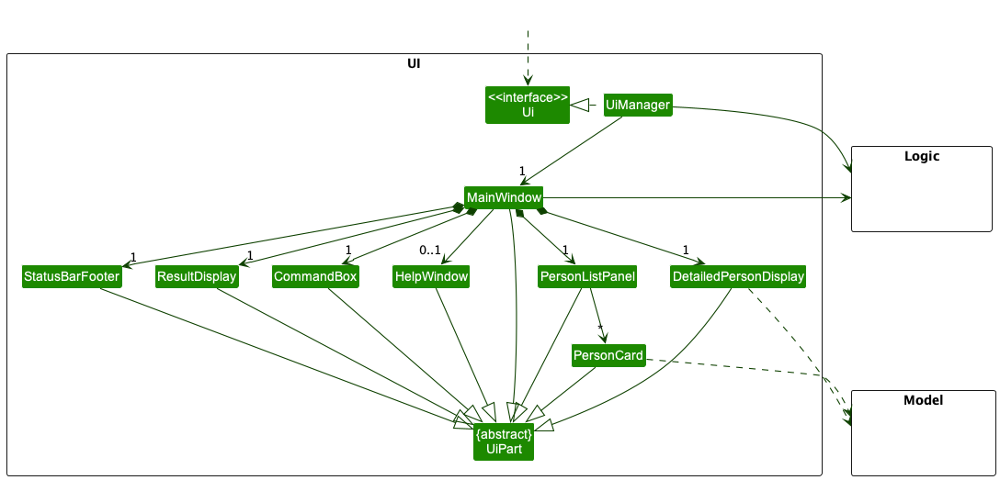

The UI consists of a `MainWindow` that is made up of parts e.g.`CommandBox`, `ResultDisplay`, `PersonListPanel`, `StatusBarFooter` etc. All these, including the `MainWindow`, inherit from the abstract `UiPart` class which captures the commonalities between classes that represent parts of the visible GUI.

The `UI` component uses the JavaFx UI framework. The layout of these UI parts are defined in matching `.fxml` files that are in the `src/main/resources/view` folder. For example, the layout of the [`MainWindow`](https://github.com/se-edu/addressbook-level3/tree/master/src/main/java/seedu/address/ui/MainWindow.java) is specified in [`MainWindow.fxml`](https://github.com/se-edu/addressbook-level3/tree/master/src/main/resources/view/MainWindow.fxml)

The `UI` component,

* executes user commands using the `Logic` component.
* listens for changes to `Model` data so that the UI can be updated with the modified data.
* keeps a reference to the `Logic` component, because the `UI` relies on the `Logic` to execute commands.
* depends on some classes in the `Model` component, as it displays `Person` object residing in the `Model`.

### Logic component

**API** : [`Logic.java`](https://github.com/se-edu/addressbook-level3/tree/master/src/main/java/seedu/address/logic/Logic.java)

Here's a (partial) class diagram of the `Logic` component:

How the `Logic` component works:
1. When `Logic` is called upon to execute a command, it uses the `AddressBookParser` class to parse the user command.
1. This results in a `Command` object (more precisely, an object of one of its subclasses e.g., `AddCommand`) which is executed by the `LogicManager`.
1. The command can communicate with the `Model` when it is executed (e.g. to add a person).
1. The result of the command execution is encapsulated as a `CommandResult` object which is returned back from `Logic`.

The Sequence Diagram below illustrates the interactions within the `Logic` component for the `execute("delete 1")` API call.

:information_source: **Note:** The lifeline for `DeleteCommandParser` should end at the destroy marker (X) but due to a limitation of PlantUML, the lifeline reaches the end of diagram.

Here are the other classes in `Logic` (omitted from the class diagram above) that are used for parsing a user command:

How the parsing works:
* When called upon to parse a user command, the `AddressBookParser` class creates an `XYZCommandParser` (`XYZ` is a placeholder for the specific command name e.g., `AddCommandParser`) which uses the other classes shown above to parse the user command and create a `XYZCommand` object (e.g., `AddCommand`) which the `AddressBookParser` returns back as a `Command` object.
* All `XYZCommandParser` classes (e.g., `AddCommandParser`, `DeleteCommandParser`, ...) inherit from the `Parser` interface so that they can be treated similarly where possible e.g, during testing.

### Model component
**API** : [`Model.java`](https://github.com/AY2122S2-CS2103T-T17-4/tp/tree/master/src/main/java/seedu/address/model/Model.java)

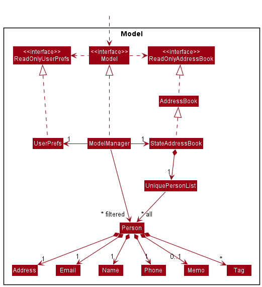

The `Model` component,

* stores the address book data i.e., all `Person` objects (which are contained in a `UniquePersonList` object).
* stores the currently 'selected' `Person` objects (e.g., results of a search query) as a separate _filtered_ list which is exposed to outsiders as an unmodifiable `ObservableList<Person>` that can be 'observed' e.g. the UI can be bound to this list so that the UI automatically updates when the data in the list change.
* stores a `UserPref` object that represents the user’s preferences. This is exposed to the outside as a `ReadOnlyUserPref` objects.
* does not depend on any of the other three components (as the `Model` represents data entities of the domain, they should make sense on their own without depending on other components)

:information_source: **Note:** An alternative (arguably, a more OOP) model is given below. It has a `Tag` list in the `AddressBook`, which `Person` references. This allows `AddressBook` to only require one `Tag` object per unique tag, instead of each `Person` needing their own `Tag` objects. 

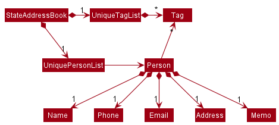

### Storage component

**API** : [`Storage.java`](https://github.com/se-edu/addressbook-level3/tree/master/src/main/java/seedu/address/storage/Storage.java)

The `Storage` component,
* can save both address book data and user preference data in json format, and read them back into corresponding objects.
* inherits from both `AddressBookStorage` and `UserPrefStorage`, which means it can be treated as either one (if only the functionality of only one is needed).
* depends on some classes in the `Model` component (because the `Storage` component's job is to save/retrieve objects that belong to the `Model`)

### Common classes

Classes used by multiple components are in the `seedu.addressbook.commons` package.

--------------------------------------------------------------------------------------------------------------------

## **Implementation**

This section describes some noteworthy details on how certain features are implemented.

### Undo and redo feature

The address book undo and redo mechanism is managed by `StateAddressBook`, which extends `AddressBook`. It keeps track of the address book state history, stored internally as a `stateHistory` and `currentStateIndex`. `currentStateIndex` points to the current state of the address book. The number of undoable and redoable actions is capped by `UNDO_REDO_CAPACITY`, currently set to 20. Additionally, it implements the following operations:

* `StateAddressBook#undo()` — Restores the address book to its previous state.
* `StateAddressBook#redo()` — Restores the address book to a previously undid state.
* `StateAddressBook#saveState()` — Saves the current address book state in stateHistory.
* `StateAddressBook#isUndoable()` — Returns if the address book is undoable.
* `StateAddressBook#isRedoable()` — Returns if the address book is redoable.

These operations are exposed in the `Model` interface respectively as
* `Model#undoAddressBook()`
* `Model#redoAddressBook()`
* `Model#saveAddressBookState()`
* `Model#canUndoAddressBook()`
* `Model#canRedoAddressBook()`

Commands that do not modify the address book states will not call `Model#saveAddressBookState()`. The address book undo and redo mechanism only tracks commands that modify the address book state, the commands that are undoable and redoable are `add`, `edit`, `delete` and `clear`.

Given below is an example usage scenario and how undo and redo mechanism behaves at each step. For demonstration, `UNDO_REDO_CAPACITY` is set to 3.

Step 1. The user launches the application for the first time. The `StateAddressBook` will be initialized with the initial address book state, and the `currentStateIndex` points to the initial address book state.

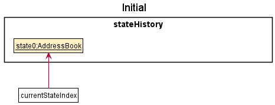

Step 2. The user executes `edit 1 n/Bob` command to edit the first person in the address book. After the `edit` command executes, it calls `Model#saveAddressBookState()`, which saves the modified state of the address book to `stateHistory`, and the `currentStateIndex` is shifted to the newly inserted address book state.

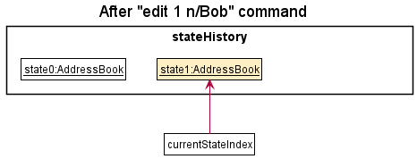

Step 3. The user executes `delete 2` to delete the second person. The `delete` command also calls `Model#saveAddressBookState()`, creating another modified address book state to be saved into the `stateHistory`. As before, `currentStateIndex` is incremented.

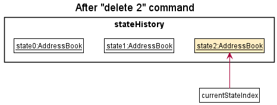

:information_source: **Note:** If a `Command#execute` fails, it will not call `Model#commitAddressBook()`, so the address book state will not be saved into `stateHistory` and `currentStateIndex` will not change.

Step 4. The user executes `clear` to clear the address book. The `clear` command also calls `Model#saveAddressBookState()`, creating another modified address book state to be saved into the `stateHistory`. Similarly, `currentStateIndex` is incremented.

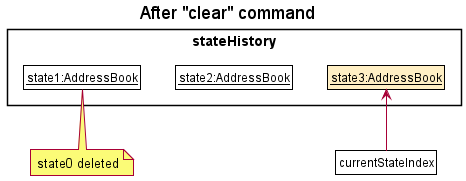

:information_source: **Note:** If `stateHistory#isFull()` is true, i.e. size of `stateHistory` is equal to `UNDO_REDO_CAPACITY` + 1, then the state at index 0 of `stateHistory` will be removed.

Step 5. The user decides that clearing his address book was not a good idea. He executes `undo` to restore his contacts. The `undo` command calls `Model#undoAddressBook()`, which will decrement the `currentStateIndex`, shifting it left once. `currentStateIndex` now points to the previous address book state, and restores the address book to that state.

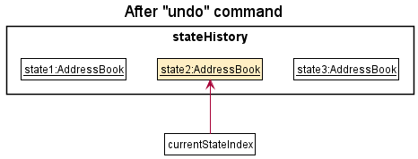

Step 6. The user wants to revert his `delete 2` command from Step 3 as well. He executes `undo` to revert the deletion. Similarly to Step 5, the `delete` command calls `Model#undoAddressBook()`, which will decrement the `currentStateIndex`, shifting it left once. `currentStateIndex` now points to the previous address book state, and restores the address book to that state.

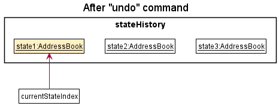

:information_source: **Note:** If the `currentStateIndex` is at index 0, there are no previous address book states to restore. The `undo` command calls `Model#canUndoAddressBook()` to check if it is undoable. In this case, if `undo` is executed once more, return an error will be returned to the user rather than performing the undo mechanism.

The following sequence diagram shows how the undo operation works:

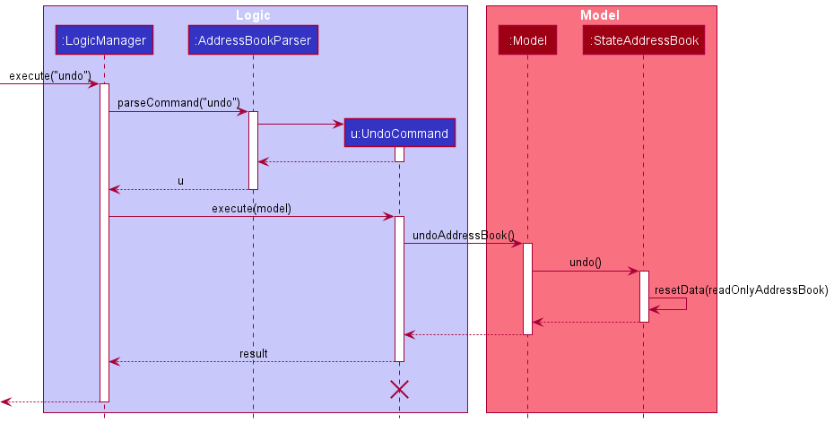

:information_source: **Note:** The lifeline for `UndoCommand` should end at the destroy marker (X) but due to a limitation of PlantUML, the lifeline reaches the end of diagram.

Step 7. The user can't make up his mind and decides to redo his undo. He executes `redo` to revert the previously undid command `delete 2`. The `delete` command calls `Model#redoAddressBook()`, which will increment the `currentStateIndex`, shifting it right once. `currentStateIndex` now points to the previous undid address book state, and restores the address book to that state.

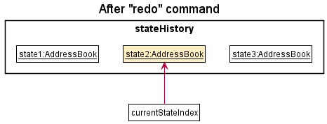

  
:information_source: **Note:** If `currentStateIndex` is at index `stateHistory.size() - 1`, pointing to the latest address book state, there are no undone AddressBook states to restore. The `redo` command calls `Model#canRedoAddressBook()` to check if this is the case. If so, it will return an error to the user rather than performing the redo mechanism.

Step 8. The user executes the `list` command. Commands that do not modify the address book state, such as `list`, will not call `Model#saveAddressBookState()`. Hence, `stateHistory` does not change.

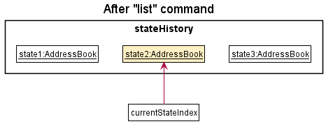

Step 9. The user executes `add n/Tom …​`, which calls `Model#saveAddressBookState()`. Since `currentStateIndex` is not pointing at the end of the `stateHistory`, all address book states after the `currentStateIndex` will be cleared by calling `StateAddressBook#clearAfterCurrentStateIndex()`. Why this is so is because it no longer makes sense to redo the `clear` command. This behaviour follows modern application undo and redo functionality.

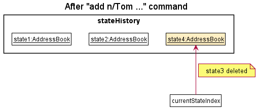

The following activity diagram summarizes what happens when a user executes a new command:

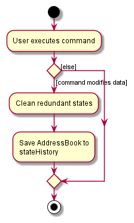

#### Design considerations:

**Aspect: How undo & redo executes:**

* **Current implementation:** Saves the entire address book.
    * Pros: Easy to implement.
    * Cons: May have performance issues in terms of memory usage.
    * Workaround: Limit the number of undoable and redoable actions, using `UNDO_REDO_CAPACITY`. Currently, it is set to 20.

* **Current implementation:** `stateHistory` is an `ArrayList`.
    * Pros: Easy to implement and less prone to bugs.
    * Cons: Inefficiency of removing old states. Since `stateHistory` is an `ArrayList`, when `StateAddressBook#saveState()` is called and `StateAddressBook#isFull()` is true, i.e. `stateHistory.size()` is equal to `UNDO_REDO_CAPACITY` + 1, the first index is removed via `ArrayList.remove(0)`, which has a time complexity of O(n).
    * Solution: Use a doubly linked list with next and previous pointers to achieve O(1) time complexity for all `StateAddressBook` methods. However, Java in-built lists do not support next and previous pointers. Hence, we will need to carefully implement a doubly linked list and ensure that it is bug free.

* **Alternative 1:** Individual command knows how to undo and redo by itself.
    * Pros: `stateHistory` will use less memory. E.g. for `delete` it only needs to save the person being deleted.
    * Cons: We must ensure that the implementation of each individual command are correct.

### Find feature
The address book find command allow users to search contacts based on their name, email, phone, address, tags, and memo. When the user keys in a find command, the user input is parsed through a ``FindCommandParser`` and if a valid input is given, the ``FindCommand#execute(Model)`` method will be invoked. Doing this will effectively filter the person list in the ``Addressbook`` and this filtered list will be returned to the Ui for display.

Given below is a sequence diagram to show the execution flow of the find command and a walk-through for each step of the execution:

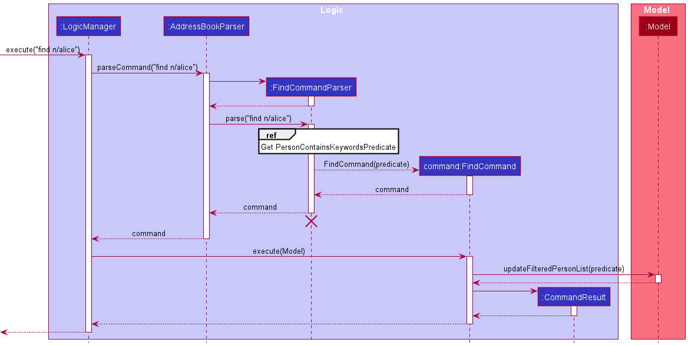
 
 
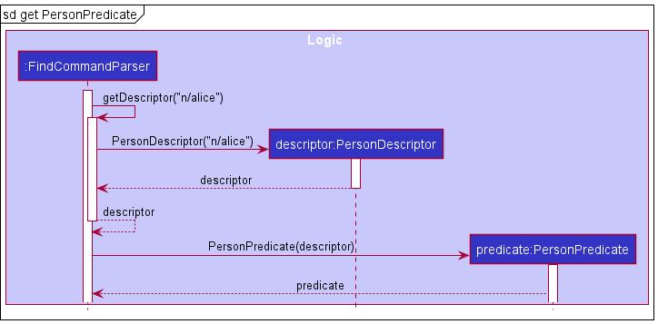

Step 1. When a user invokes a find command from the Ui, ``LogicManager`` will be called, which parses the user input into ``AddressbookParser#parseCommand(String)``.

Step 2. ``FindCommandParser`` will then be instantiated and ``FindCommandParser#parse(String)`` is invoked. If a valid input is provided, ``FindCommandParser#getDescriptor(String)``is called.

Since a user can key in multiple valid parameters to increase the scope of a search (i.e. search by name and tags), we will need a way to identify different parts of the user input and match the input to their corresponding prefix. This can be achieved with the ``FindPersonDescriptor`` class where it will store the descriptions to search a person by.

Step 3. The ``FindPersonDescriptor`` object is passed as an argument into the  ``PersonPredicate`` constructor and the object created is returned to ``FindCommandParser``.

  
:information_source: **Note:** Two note-worthy classes that are created in ``PersonPredicate`` but not shown in the sequence diagram is the ``ExactWordMatchPredicate`` and ``PartialWordMatchPredicate`` which encapsulate the logic of conducting exact word match and partial word match on a person's attribute respectively. They are used in the ``PersonPredicate#test(Person)`` method during the filter process and to conduct exact word match/partial word match depending on the person's attribute. More information will be given in the design consideration. 

Step 4. ``FindCommandParser`` will then use the predicate object to create the ``FindCommand`` object and this object is returned to ``LogicManager``.

Step 5. ``LogicManager`` will then call ``FindCommand#execute(Model)`` method and this method will invoke 
``Model#updateFilteredPersonList(PersonContainsKeywordsPredicate)`` where it will update the filter for the person list in the address book.

Step 6. After the filter has been updated, each person in the person list will be tested against the predicate to see if any of the information in the person's attribute matches any of the keywords provided by the user. The filtered list is created and returned to the Ui.

**Design Considerations:** 

**Aspect: How find feature executes:** 
* **Current implementation:** Each invocation of the find feature filters the original person list. 
    * Pros: It is easy to implement. 
    * Cons: Users might want to filter the filtered person list even further after viewing it but with the current implementation, this is not possible.  
    * Workaround: To simulate the chaining of multiple find commands, users will have to remember their search condition(s) for the first find and add on/modify the search condition(s) in subsequent find commands. A history feature is developed to assist users to achieve that as it returns the most recent command that is parsed into the application. By invoking the history command, the search condition of the previous find command can be retrieved and all the user have to do is to add on to the returned search condition(s).  
    
* **Alternative 1:** Allow chaining of the find command so that filtering of the filtered person list can be performed.  
    * Pros: It is a useful feature to have. 
    * Cons: It is costly in terms of time and effort to develop as the current implementation can already achieve a similar functionality. To allow chaining of the find command, we will have to change the data structure that stores the filtered person list and since there are multiple classes in the application that relies on this list, changing it might require us to change certain components in other classes as well.

**Aspect: How the find feature matches words**
* **Current implementation:** Different search criteria for different search parameters. For example, address, memo and tags follows an exact word match criteria while name, phone and email follows a partial word match criteria. 
  * Pros: Allows for a more accurate search that meets the needs of the user (as opposed to adopting a single search criteria for all the person's attribute). 
    * Tags was chosen to follow the exact word match criteria because users are likely to remember the full word of a tag and search for them.
    * As for address and memo, since those attributes can be stored as sentences, allowing a partial word match would increase the average hit rate per search query and as a result, lead to a search result that may not show any meaningful information. For instance, the word "a" often appears in many sentences in the English language thus, allowing for this partial search of the word "a" in a sentence may produce many result the user might not want. Hence, an exact word match criteria was chosen for address and memo. 
    * Phone number, name and email follows a partial word match criteria where users are able to search for contacts based on the keywords they provide. For example, if John has a phone number 90400202, then `find p/9040` would return John. 
  * Cons: Edge cases that may cause the search to be ineffective are present and one such test case would be: ``find e/gmail`` where the intended effect the user might want is to search for all contacts that have the email address that has the domain name set as "gmail". However, the email "redherringmail@yahoo" will be matched with the user query and this search result does not meet the intended effect the user might want.  
  * Temporary workaround: Instead of searching for "gmail", users are able to search for "@gmail" if they would want to find all contacts that have the domain name set as "gmail".  
  

* **Alternative 1:** Same search criteria for all the search parameters. 
  * Pros: Easy to implement.
  * Cons: It might lead to nonsensical search results especially when partial word match is used for the memo and address attribute.

  
:information_source: **Note:** A word is defined as consecutive characters that is bounded by whitespaces.
e.g. "This is a sentence!" contains the word "This", "is", "a" and "sentence! 

  
### \[Proposed\] Data archiving

_{Explain here how the data archiving feature will be implemented}_

--------------------------------------------------------------------------------------------------------------------

## **Documentation, logging, testing, configuration, dev-ops**

* [Documentation guide](Documentation.md)
* [Testing guide](Testing.md)
* [Logging guide](Logging.md)
* [Configuration guide](Configuration.md)
* [DevOps guide](DevOps.md)

--------------------------------------------------------------------------------------------------------------------

## **Appendix: Requirements**

### Product scope

**Target user profile**:

* Marcus is a 26 years old fresh graduate and has started working as a financial advisor.
* He is well versed in tech and prefers a command-line interface for performing tasks.
* Due to the nature of his work, he stores numerous client contacts on his google contacts, but dislikes it’s interface.
* He dislikes mixing his professional and personal contacts.
* He wants a way to store his clientele details in a separate place.
* He likes to get things done fast.
* He prefers typing over using a mouse.
* He is reasonably comfortable using CLI apps.

**Value proposition**:
- Manage contacts faster than a typical mouse/GUI driven app.
- Display all relevant information of clients on a single application.
- Saves the insurance agent time and effort to look for a contact.
- Allow users to consolidate notes pertaining to their clients in a convenient way.

### User stories

Priorities: High (must have) - `* * *`, Medium (nice to have) - `* *`, Low (unlikely to have) - `*`

| Priority | As a …​                                    | I want to …​                                              | So that I can…​                                                               |
|----------|--------------------------------------------|-----------------------------------------------------------|-------------------------------------------------------------------------------|
| `* * *`  | new user                                   | see usage instructions                                    | refer to instructions when I forget how to use the App                        |
| `* * *`  | user                                       | see the app already populated with sample contacts        | see how the app will look when it’s running                                   |
| `* * *`  | user                                       | add my new contacts                                       | store my contacts in the app                                                  |
| `* * *`  | user                                       | list all my contacts                                      | see all my contacts in the app                                                |
| `* * *`  | user                                       | edit a contact                                            | correct mistakes I’ve made when adding in the contacts                        |
| `* * *`  | user                                       | find my contacts                                          | access my desired contact without having to sieve through my entire phonebook |
| `* * *`  | user                                       | save my contacts in the phonebook                         | whenever I re-launch the application, my contacts will still be in it         |
| `* * *`  | user                                       | create tags and group the contacts using them             | separate my work and personal contacts                                        |
| `* * *`  | user                                       | clear all my entries with a single command                | remove all my contacts without having to manually delete them one at a time   |
| `* * *`  | user                                       | delete a person                                           | remove entries that I no longer need                                          |
| `* * *`  | user                                       | find a person by name                                     | locate details of persons without having to go through the entire list        |
| `* * *`  | user                                       | undo my actions                                           | restore previous address book states                                          |
| `* * *`  | user                                       | redo my actions                                           | restore previous undid address book states                                    |
| `* *`    | intermediate user                          | not have duplicated phone number or email                 | add and edit contacts without keeping track of duplicates                     |
| `* *`    | intermediate user                          | invoke my most recently used command                      | add/modify/delete multiple contacts in a more efficient manner                |
| `* *`    | intermediate user                          | find contacts by their name, phone number, tags and email | find the contacts I want quickly                                              |
| `* *`    | intermediate user                          | add memo to a contact                                     | keep track of miscellaneous information about a person                        |
| `* *`    | intermediate user                          | edit memo of a contact                                    | modify or delete memo of a contact                                            |
| `*`      | user with many persons in the address book | sort persons by name                                      | locate a person easily                                                        |

*{More to be added}*

### Use cases

(For all use cases below, the **System** is the `AddressBook` and the **Actor** is the `user`, unless specified otherwise)

**Use case: Delete a person**

**MSS**

1.  User requests to list persons.
2.  AddressBook shows a list of persons.
3.  User requests to delete a specific person in the list.
4.  AddressBook deletes the person.

    Use case ends.

**Extensions**

* 2a. The list is empty.

  Use case ends.

* 3a. The given index is invalid.

    * 3a1. AddressBook shows an error message.

      Use case resumes at step 2.

**Use case: Edit a person**

**MSS**

1.  User requests to list persons.
2.  AddressBook shows a list of persons.
3.  User requests to Edit a specific person in the list.
4.  AddressBook update the person with new information.

    Use case ends.

**Extensions**

* 2a. The list is empty.

  Use case ends.

**Use case: Adding a tag to a person**

**MSS**

1.  User find a person.
2.  AddressBook shows the searching result of the person.
3.  User requests to add a tap to a specific person.
4.  AddressBook adds that tag to the person.

    Use case ends.

**Extensions**

* 2a. Cannot find the user.

  Use case ends.

* 3a. The tag is invalid.

    * 3a1. The tag exist already.

      ABπ show notification message.

      Use case ends.

    * 3a2. The tag exceeds the max length.

      ABπ show error message.

      Use case resumes at step 2.

**Use case: Adding memo to a person**

**MSS**

1.  User find a person.
2.  AddressBook shows the searching result of the person.
3.  User requests to add memo to a specific person.
4.  AddressBook adds that memo to the person.

    Use case ends.

**Extensions**

* 2a. Cannot find the user.

  Use case ends.

* 3a. The memo is invalid.

    * 3a1. The memo exceeds the max length.

      ABπ show error message.

      Use case resumes at step 2.

*{More to be added}*

### Non-Functional Requirements

1. Should work on any _mainstream OS_ as long as it has Java `11` or above installed.
2. Should be able to hold up to 1000 persons without a noticeable sluggishness in performance for typical usage.
3. A user with above average typing speed for regular English text (i.e. not code, not system admin commands) should be able to accomplish most of the tasks faster using commands than using the mouse.
4. The main window should be resizable in order to fit different screen size.

*{More to be added}*

### Glossary

* **Mainstream OS**: Windows, Linux, Unix, OS-X
* **ABπ**: Name of this AddressBook
* **Memo**: Remark or note for a specific person

--------------------------------------------------------------------------------------------------------------------

## **Appendix: Instructions for manual testing**

Given below are instructions to test the app manually.

:information_source: **Note:** These instructions only provide a starting point for testers to work on;
testers are expected to do more *exploratory* testing.

### Launch and shutdown

1. Initial launch

    1. Download the jar file and copy into an empty folder

    1. Double-click the jar file Expected: Shows the GUI with a set of sample contacts. The window size may not be optimum.

1. Saving window preferences

    1. Resize the window to an optimum size. Move the window to a different location. Close the window.

    1. Re-launch the app by double-clicking the jar file. 
       Expected: The most recent window size and location is retained.

1. _{ more test cases …​ }_

### Deleting a person

1. Deleting a person while all persons are being shown

    1. Prerequisites: List all persons using the `list` command. Multiple persons in the list.

    1. Test case: `delete 1` 
       Expected: First contact is deleted from the list. Details of the deleted contact shown in the status message. Timestamp in the status bar is updated.

    1. Test case: `delete 0` 
       Expected: No person is deleted. Error details shown in the status message. Status bar remains the same.

    1. Other incorrect delete commands to try: `delete`, `delete x`, `...` (where x is larger than the list size) 
       Expected: Similar to previous.

1. _{ more test cases …​ }_

### Editing a person's memo

1. Editing a person's memo while all persons are being shown

    1. Prerequisites: List all persons using the `list` command. Multiple persons in the list.

    2. Test case: `edit 1 m/interested in xx policy` 
       Expected: First contact's memo is edited to "interested in xx policy". Details of the edited contact shown in the status message.

    3. Test case: `edit 2 m/` 
       Expected: Second contact's memo is cleared. Details of the edited contact shown in the status message.

    4. Other incorrect edit commands to try: `edit`, `edit 1 bob`, `edit x m/VP`, `...` (where x is larger than the list size or smaller than 1) 
       Expected: Invalid command message displaying the format for proper command usage.

### Saving data

1. Dealing with missing/corrupted data files

    1. _{explain how to simulate a missing/corrupted file, and the expected behavior}_

1. _{ more test cases …​ }_
