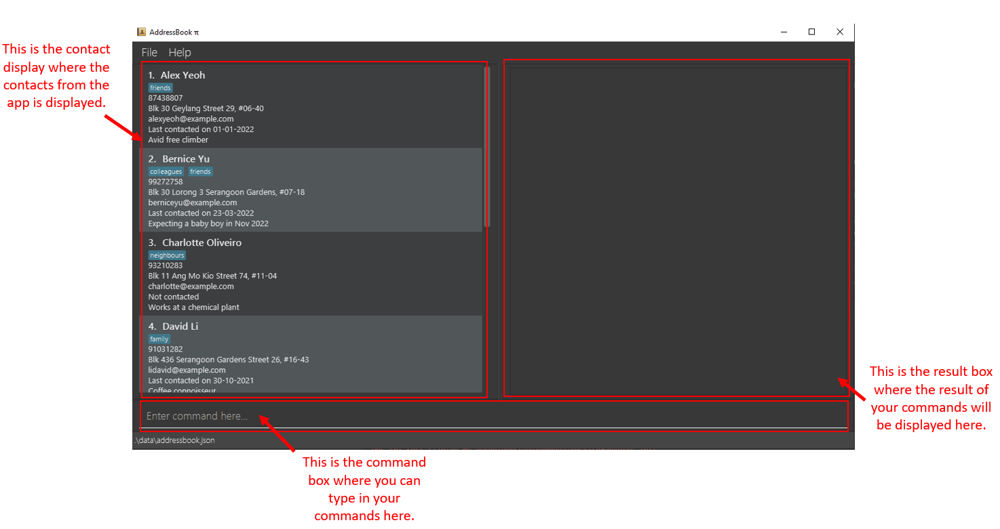

## Overview
AddressBook pi (Abπ) is a **360° all-rounded desktop app for managing contacts, optimized for use via a Command Line Interface** (CLI). Abπ is catered towards fast-typers and individuals who want an organized address book with modern features. Its key features include efficient filtering of contacts based on various attributes (name, email, tags, etc), copying of all emails in the address book and a memo section that allows you to note down notable details about a person. Whether you are an insurance agent who needs to manage numerous client contacts, or a student leader who needs to contact a large number of students, Abπ got you covered. So what are you waiting for? Download and try out Abπ today!

---

## Table of Content  

[1. Introduction](#1-introduction)  
&nbsp;&nbsp;[1.1. Conventions](#11-conventions)  
[2. Quick Start](#2-quick-start)  
&nbsp;&nbsp;[2.1. Installation](#21-installation)  
&nbsp;&nbsp;[2.2 System Requirements](#22-system-requirements)  
[3. About](#3-about)  
[4. Features](#4-features)  
&nbsp;&nbsp;[4.1. Viewing help](#41-viewing-help--help)  
&nbsp;&nbsp;[4.2. Listing all persons](#42-listing-all-persons--list)  
&nbsp;&nbsp;[4.3. Adding a person](#43-adding-a-person-add)  
&nbsp;&nbsp;[4.4. Editing a person](#44-editing-a-person--edit)  
&nbsp;&nbsp;[4.5. Find person by their attributes](#45-find-person-by-their-attributesfind)  
&nbsp;&nbsp;[4.6. Undoing commands](#46-undoing-commands-)  
&nbsp;&nbsp;[4.7. Redoing commands](#47-redoing-commands-)  
&nbsp;&nbsp;[4.8. Invoking recent command](#48-invoking-recent-command--history)  
&nbsp;&nbsp;[4.9. Copying Emails](#49-copying-emails--copyemails)  
&nbsp;&nbsp;[4.10. Deleting a person](#410-deleting-a-person--delete)  
&nbsp;&nbsp;[4.11. Clearing all entries](#411-clearing-all-entries--clear)  
&nbsp;&nbsp;[4.12. Exiting the program](#412-exiting-the-program--exit)  
&nbsp;&nbsp;[4.13. Extra information regarding the features](#413-extra-information-regarding-the-features)  
[5. FAQ](#5-faq)  
[6. Command Summary](#6-command-summary)  

----

## 1. Introduction
This document is the user guide for AddressBook Level 3.14 (Abπ), an all-rounded desktop app for managing contacts. It is primarily targeted towards fast-typers and individuals who prefer working on a Command-Line Interface (CLI). 

*If you're unfamiliar with Command-Line Interfaces (CLIs), you can find out more about them [here](https://en.wikipedia.org/wiki/Command-line_interface)!*

**Before we begin, let us understand the different technical terminologies that will be used in this user guide.**

 Word | What it means                                                                   |
------|---------------------------------------------------------------------------------|
Command box| Text box in the Abπ that allows user to type in texts.                          |
Command| A sentence that causes Abπ to do something when typed into the command box.     |
Command word | The first word of every command.                                                |
Parameters | Information that is supplied by the user.                                       |
Execute | The process by which Abπ reads the instructions written by user and acts on it. |

### 1.1. Conventions
When this document is read, certain words or sentences are represented in different fonts, typefaces, sizes and weights. This highlighting is systematic where different words will be represented in the same style to indicate their inclusion in a specific category. Below is a table that shows what those categories are and how they are represented by each format/symbol.

Symbol | What it means |
--------|-------------------|
`add` | Words/sentences that have this format of display are texts/keyboard commands that can cause an action in Abπ
*Italics* | Sentences that are in italics represent additional information.
:exclamation: | Warning/cautionary statement that should be read. 
:bulb: | Extra tip that may be useful to the reader.
:information_source: | Important information to take note.          
[here](") |Words that are in this format are clickable links that directs you to a certain webpage.

------------

## 2. Quick start
### 2.1. Installation
1. Ensure you have Java 11 or above installed in your Computer.

2. Download the latest Abπ.jar from [here](https://github.com/AY2122S2-CS2103T-T17-4/tp/releases).

3. Copy the file to the folder you want to use as the home folder for your AddressBook.

4. Double-click the file to start the app. The GUI similar to below should appear in a few seconds. Note how the app contains some sample data. 
   

5. Type the command in the command box and press Enter to execute it. e.g. typing **`help`** and pressing Enter on your keyboard will open the help window. 
   Some example commands you can try:

   * `list`: Lists all contacts.

   * `addn/John Doe p/98765432 e/johnd@example.com a/John street, block 123, #01-01` : Adds a contact named `John Doe` to the Address Book.

   * `delete 3` : Deletes the 3rd contact shown in the current list.

   * `clear` : Deletes all contacts.

   * `exit` : Exits the app.

6. Refer to the [features](#4-features) below for details of each command.

### 2.2. System Requirements
Ideally, the machine you are running on should be able to run Java. Below is a list of system specifications that supports Abπ.

_For more information on Java 8, click [here](https://www.oracle.com/java/technologies/downloads/)_

### Windows
* Windows 10 (8u51 and above)
* Windows 8.x (Desktop)
* Windows 7 SP1
* Windows Vista SP2
* Windows Server 2008 R2 SP1 (64-bit)
* Windows Server 2012 and 2012 R2 (64-bit)
* RAM: 128 MB
* Disk space: 124 MB for JRE; 2 MB for Java Update
* Processor: Minimum Pentium 2 266 MHz processor
 

### Mac OS X
* Intel-based Mac running Mac OS X 10.8.3+, 10.9+
* Administrator privileges for installation

## 3. About

This section will bring you through the Graphical User Interface (GUI) of Abπ.

## 4. Features

**:information_source: Notes about the command format:** 

* Words in upper case are the parameters to be supplied by the user. e.g. in `add n/NAME`, `NAME` is a parameter which can be used as `add n/John Doe`.

* Items in square brackets are optional. e.g `n/NAME [t/TAG]` can be used as `n/John Doe t/friend` or as `n/John Doe`.

* Items with `…`​ after them can be used multiple times including zero times. e.g. `[t/TAG]…​` can be used as ` ` (i.e. 0 times), `t/friend`, `t/friend t/family` etc.

* Parameters can be in any order. e.g. if the command specifies `n/NAME p/PHONE_NUMBER`, `p/PHONE_NUMBER n/NAME` is also acceptable.

* If a parameter is expected only once in the command, but you specified it multiple times, only the last occurrence of the parameter will be taken. e.g. if you specify `p/12341234 p/56785678`, only `p/56785678` will be taken.

* Commands that do not take in parameters (`help`, `list`, `copyemails`, `undo`, `redo`, `previous`, `next`, `clear`, `exit`) will not be recognized if there are extraneous parameters.
  This is to protect from accidental invocations of the wrong command. e.g. if the command specifies `clear 1`, it will be interpreted as an invalid command. The proper format is `clear`.

 

### 4.1. Viewing help : `help`

Shows a message explaining how to access the help page.

Format: `help`

 

### 4.2. Listing all persons : `list`

Shows a list of all persons in the address book.

Format: `list`

 

### 4.3. Adding a person: `add`

Adds a person to the address book.

Format: `add n/NAME p/PHONE_NUMBER e/EMAIL a/ADDRESS [c/CONTACTED DATE] [m/MEMO] [t/TAG]…​`

:bulb: **Tip:**
 Contacted Date and Memo is optional

:bulb: **Tip:**
 A person can have any number of tags (including 0)

Examples:
* `add n/John Doe p/98765432 e/johnd@example.com a/John street, block 123, #01-01 c/01-01-2020 m/Avid free climber`
* `add n/Betsy Crowe t/friend e/betsycrowe@example.com a/Newgate Prison p/1234567 m/Partner in crime t/criminal`

 

### 4.4. Editing a person : `edit`
Edits an existing person in the address book.

Format: `edit INDEX [n/NAME] [p/PHONE] [e/EMAIL] [a/ADDRESS] [c/CONTACTED DATE] [m/MEMO] [t/TAG]…​`

* Edits the person at the specified `INDEX`. The index refers to the index number shown in the displayed person list. The index **must be a positive integer** 1, 2, 3, …​
* At least one of the optional fields must be provided.
* Existing values will be updated to the input values.
* When editing tags, the existing tags of the person will be removed i.e adding of tags is not cumulative.
* You can remove all the person’s tags or memo by typing `t/` or `m/` respectively without specifying text after it.
* You can edit a peron's contacted date to "Not contacted" by typing `c/` without specifying a date after it.

Examples:
* `edit 1 p/91234567 e/johndoe@example.com` edits the phone number and email address of the 1st person to be `91234567` and `johndoe@example.com` respectively.
* `edit 2 n/Betsy Crower t/` edits the name of the 2nd person to be `Betsy Crower` and clears all existing tags.
* `edit 2 m/Avid free climber` edits the memo of the 2nd person to be `Avid free climber`.
* `edit 2 c/01-01-2020` edits the contacted date of the 2nd person to be `Last contacted on 01-01-2020`.
* `edit 2 m/ c/` edits the memo of the 2nd person to be empty and the contacted date to be `Not contacted`.

 

### 4.5. Find person by their attributes: `find`

Finds persons whose names contain any of the given keywords.

Format: `find [n/NAME] [p/PHONE] [e/EMAIL] [a/ADDRESS] [m/MEMO] [c/Days] [t/TAG]…​`
* The search is case-insensitive. E.g. hans will match Hans
* At least 1 parameter must be present.
* More than 2 whitespace between words are treated as 1 whitespace. So "Alex_ _ _Yeoh" would be treated as "Alex_Yeoh" where "_" represents a single whitespace.
* Name, phone number, email, address, memo, tags and contacted status are eligible parameters.
* Specifying the parameter followed by the word to search for helps to scope the search to that specific attribute.
* Name, phone number and email follows a partial word match criteria where "Han" will match with "Hans" and "904" would match with "90400203".
* For contacted status, the matching depends on the "days" argument given by the user and suppose the number of days specified is n, the find method searches for contacts that were contacted at least n day days ago. 
* For contacted status, if no integer value is given as an argument, the find command would just return contacts that had not been contacted.
* Tag, address and memo follows an exact word match criteria where "Hans" will match with "Hans" or "hans".
* For both search criteria, order of the keywords does not matter. e.g. Hans Bo will match Bo Hans
* For both search criteria, as long as there is a word match (partial/exact), the contact would be in the filtered list. 

 **:information_source: 
A word is defined as consecutive characters that is bounded by whitespaces.
e.g. "This is a sentence!" contains the word "This", "is", "a" and "sentence!".** 

Examples:
* `find n/ John` returns john and John Doe
* `find n/alex n/david` returns Alex Yeoh and David Li and Alexa.
* If David Li has an email davidLi98@gmail.com, then `find e/gmail` would return David Li. 
* If John has a phone number 90400202, then `find p/9040` would return John.
* If John has a phone number 90400202, then `find p/202` would return John.
* `find n/alex yeo` would only match with contacts that have "alex yeo" contained within their name. For example, "Alex Yeoh" would be a successful match.
* If John has a tag family, then `find t/family` would return John.
* If John has a tag family, then `find t/fam` would return no result.
* `find c/1` would find contacts that were contacted 1 or more days ago.
* `find c/` would find contacts that had not been contacted.

 

### 4.6. Undoing commands 
Undo previous commands that modified data, which includes: `add`, `edit`, `delete`, `clear` and `scrub`.

Format: `undo`

Examples:
* `undo` after calling `delete 1` restores the address book to its previous state prior to the deletion.
* `undo` after calling `edit 1 n/Bob` restores the address book to its previous state prior to the edit.

 

### 4.7. Redoing commands
Redo previous undid states.

Format: `redo`

Examples:
* `redo` after calling `undo` restores the address book to its previous undid state prior to undo.

 

### 4.8. Retrieving recent commands:`UP_ARROW_KEY` or `DOWN_ARROW_KEY`
By press the `UP_ARROW_KEY` button or the `DOWN_ARROW_KEY` button on your keyboard, you can easily retrieve your recent commands and the recent command would autofill into the text box.

Examples:
* If the recent commands are `find n/Anny` `find n/Bob` `find n/Cathy`.
* Pressing `UP_ARROW_KEY` once will fill-in the textbox with "find n/Cathy".
* Then pressing `UP_ARROW_KEY` again will fill-in the textbox with "find n/Bob".
* Then pressing `DOWN_ARROW_KEY` once will fill-in the textbox with "find n/Cathy".

 

### 4.9. Copying Emails : `copyemails`

Copies a comma-separated list of all displayed emails to clipboard.

Format: `copyemails`

Examples:
* `list` followed by `copyemails` will copy all emails currently displayed in the list to your clipboard.
* When you paste from clipboard, a comma-separated list will appear. (E.g. "johndoe@example.com; betsycrowe@example.com")

 

### 4.10. Deleting a person : `delete`

Deletes the specified person from the address book.

Format: `delete INDEX`

* Deletes the person at the specified `INDEX`.
* The index refers to the index number shown in the displayed person list.
* The index **must be a positive integer** 1, 2, 3, …​

Examples:
* `list` followed by `delete 2` deletes the 2nd person in the address book.
* `find n/Betsy` followed by `delete 1` deletes the 1st person in the results of the `find` command.

 

### 4.11. Clearing all entries : `clear`

Clears all entries from the address book.

Format: `clear`

 

### 4.12. Exiting the program : `exit`

Exits the program.

Format: `exit`

 

### 4.13. Extra information regarding the features
#### Preventing duplicate entries (phone and email) 
Abπ helps to manage duplicates by preventing duplicate entries of phone number and email when using the add and edit commands. All phone numbers and emails in Abπ will be unique.

#### Saving the data
Abπ data are saved in the hard disk automatically after any command that changes the data. There is no need to save manually.

#### Editing the data file

Abπ data are saved as a JSON file `[JAR file location]/data/addressbook.json`. Advanced users are welcome to update data directly by editing that data file.

:exclamation: **Caution:**
 If your changes to the data file makes its format invalid, AddressBook will discard all data and start with an empty data file at the next run.

--------------------------------------------------------------------------------------------------------------------

## 5. FAQ

**How do I save in Abπ?** 
There is no need to save manually. Abπ automatically saves the data after any command that changes the data.

**Where does Abπ store its data?** 
Abπ data is stored in data folder located at Abπ's home directory, the data file name is `addressbook.json`. Specifically `[Abπ location]/data/addressbook.json`.

**How do I transfer my data to another computer?** 
Simply overwrite the `addressbook.json` data file with your previous `addressbook.json` data file.

**What happens if I executed a command unintentionally?** 
Fret not, Abπ supports the `undo` and `redo` commands, which follows modern application undo and redo functionality.

**Why is my data gone?** 
When the data file is corrupted, an empty address book will be shown. Do not worry, Abπ has made a backup of your previous data file, named as `backup.json`, located at `[Abπ location]/data/backup.json`. Fix the `backup.json` into the proper json format, rename it as `addressbook.json` and overwrite the existing data file.

--------------------------------------------------------------------------------------------------------------------

## 6. Command summary

Action | Format, Examples
--------|------------------
**Help** | `help`
**List** | `list`
**Add** | `add n/NAME p/PHONE_NUMBER e/EMAIL a/ADDRESS [c/CONTACTED DATE] [m/MEMO] [t/TAG]…​`   e.g., `add n/James Ho p/22224444 e/jamesho@example.com a/123, Clementi Rd, 1234665 c/01-01-2020 m/Avid hiker t/friend t/colleague`
**Edit** | `edit INDEX [n/NAME] [p/PHONE_NUMBER] [e/EMAIL] [a/ADDRESS] [c/CONTACTED DATE] [m/MEMO] [t/TAG]…​`  e.g.,`edit 2 n/James Lee e/jameslee@example.com`
**Find** | `find [n/NAME] [p/PHONE_NUMBER] [e/EMAIL] [a/ADDRESS] [m/MEMO] [t/TAG] [c/Days]…​`   e.g., `find n/James Jake`
**Undo** | `undo`
**Redo** | `redo`
**Previous**| Pressing `UP_ARROW_KEY`
**Next**| Pressing `down_ARROW_KEY`
**CopyEmails**| `copyemails`
**Delete** | `delete INDEX`  e.g., `delete 3`
**Clear** | `clear`
**Exit** | `exit`

